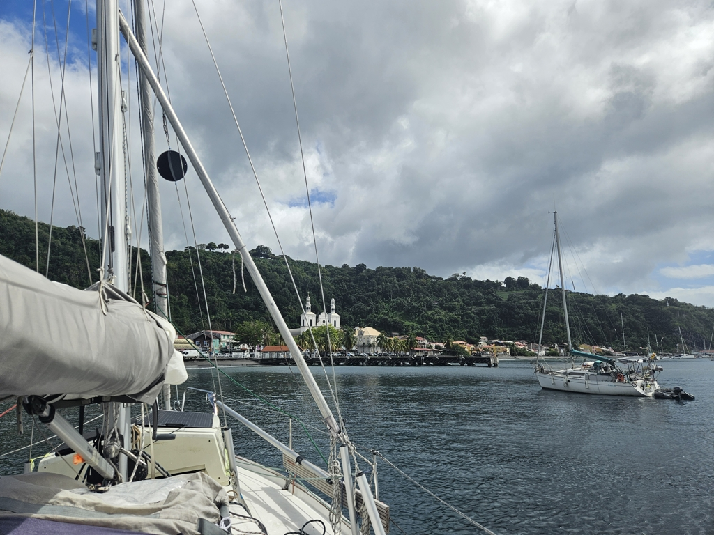

In the drizzling rain we hoisted the anchor. Few moments later, with wind gusting to 20kn we hoisted the main sail in first reef and were on our way. 

The flat waters behind Martinique were a marvel to sail. It has been months since sailing has been as smooth. With the wind sometimes howling through a valley and laying still behind a mountain there was no boring moment.

 

At Saint-Pierre there was no availability of mooring balls so we squeezed ourselves between the pier, shore and no-anchor zone set to protect the wrecks from the 1902 volcanic eruption. 

We are now gently rocking in the swell enjoying the views of the town.

* Distance today: 13NM
* Lunch: spaghetti bolognese
* Engine hours: 1.3
