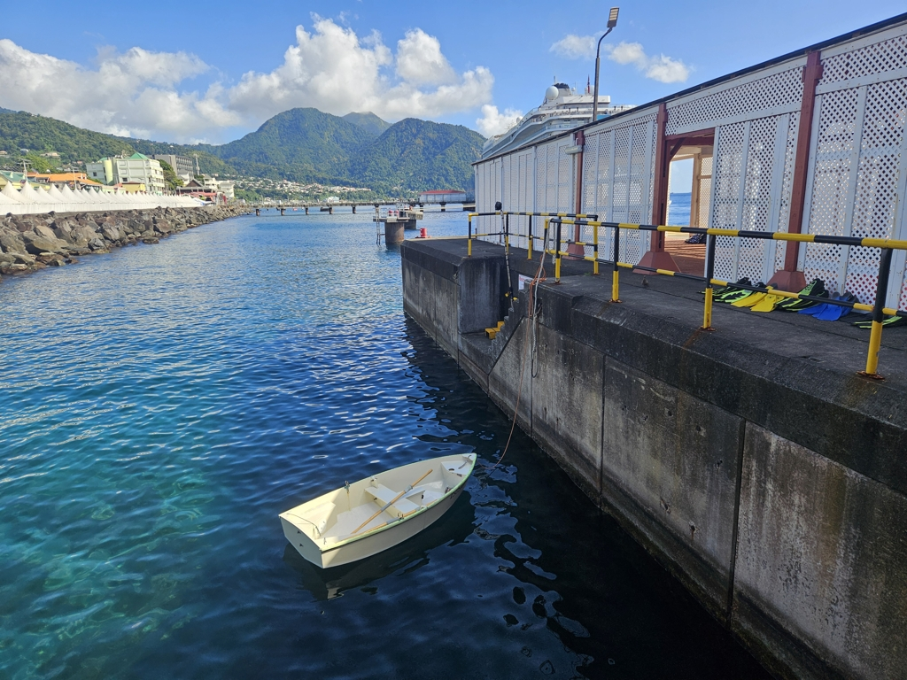

Today was the time to visit the first new country on this trip: Dominica. We prepared the boat for offshore and hoisted anchor just after sunrise.
The fast beam reach out of St. Pierre became a lumbering float-about as soon as we reached the shadow of Mt. Pelée.

Getting forward required some motoring, but the sailing conditions in the channel towards Dominca were glorious: 20kt on the beam with a quite reasonable sea state.

As we rounded Scotts Head, wind picked up to 31kt, and we were yet again happy to be flying the staysail. Then the first dolphins since Cape Verde came for a visit!

 

We dropped anchor on the north side of Roseau, near the industrial harbour. A 0.7NM row was needed for getting to the customs before they closed. Now we're cleared both in and out, meaning that there shouldn't be any bureaucratic adventures needed until we enter Guadeloupe sometime next week or so.

 

* Distance today: 37.4NM
* Lunch: couscous salad
* Engine hours: 2
