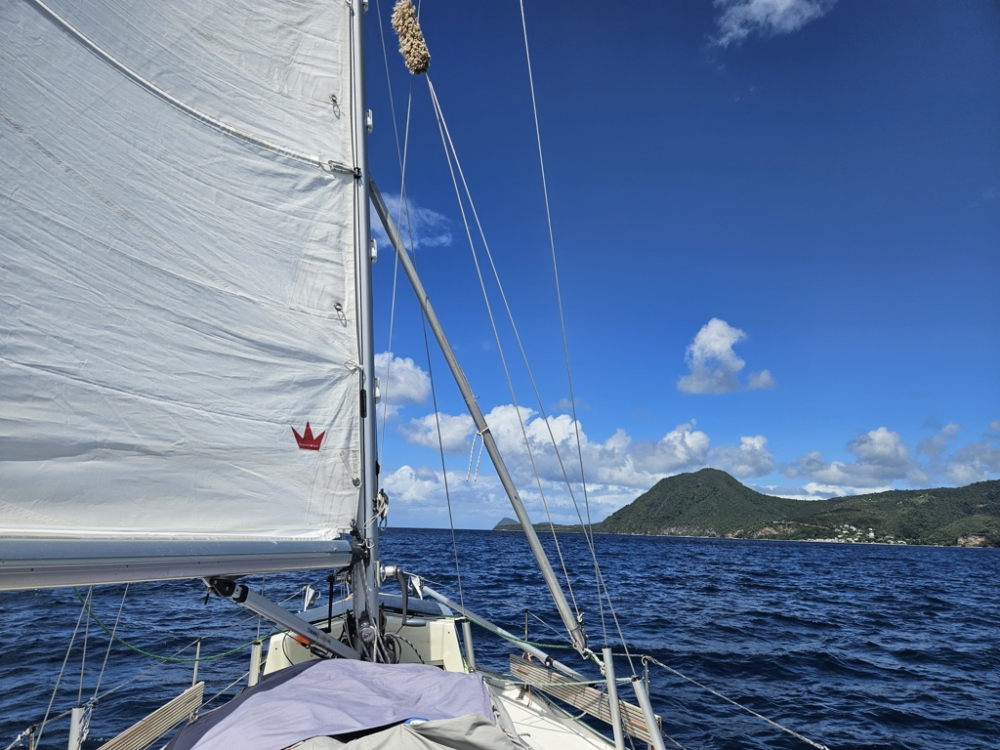

We had a fun evening in the Roseau Pottersville anchorage. Catamaran _Great Dane_ invited all boats for some sundowners. Quite a difference to our small boat!

In the morning we hoisted anchor and proceeded to sail along the coast of Dominica. We had expected mostly motoring, but it turned out there was enough wind despite it being quite turbulent. We had wind from all directions, and with forces ranging from 1kt to 31kt. But sail we did!

 

In the end a couple of tacks took us to the wide anchoring bay at Portsmouth. This is a popular spot for cruisers, and there are many trails and other nature experiences available. Maybe we'll even spot the bird that is depicted in the flag of Dominica?

* Distance today: 19NM
* Lunch: spaghetti carbonara
* Engine hours: 0.7
