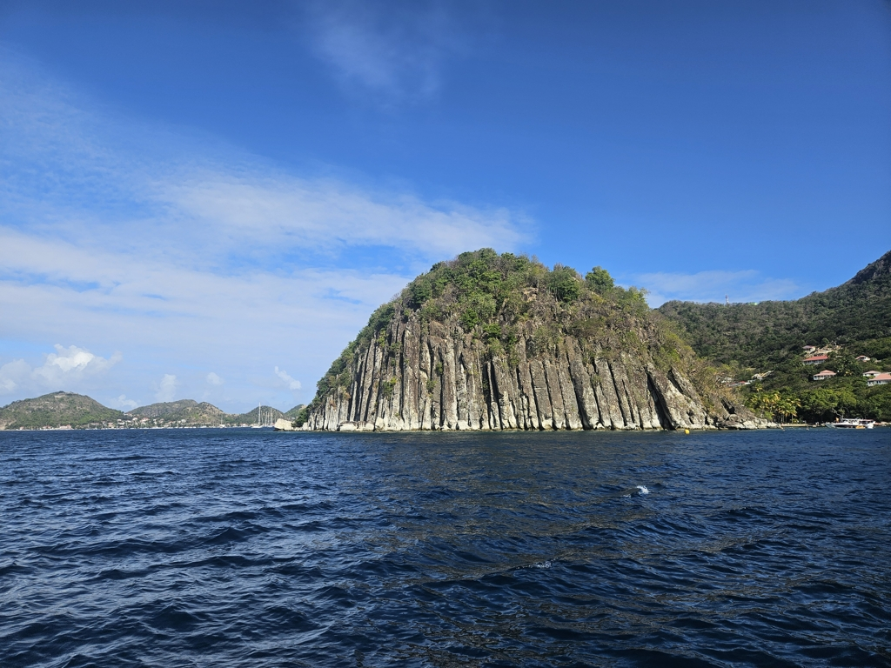

At 11:30 we were finally ready and the anchor was no longer dug deep into muddy ground of Portsmouth bay. We packed the anchor to the anchor locker and hoisted main in first reef and staysail. Then nose towards north and Guadeloupe! 

The sea state slowly built up and soon we were flying through the waves on a comfortable beam reach. As the small hop north was on its halfway mark, we changed to second reef as a small squall that had been inching closer and closer started to look menacing enough.  And like clockwork as the second reef was set, the wind got an extra 10 knots and we were happy about our decision to do the change.

 

As we rounded Grand Ilet we were greeted with a completely different landscape as in Dominica. The lush forests had changed to more arid landscape with sheer rock walls plumeting straight to the ocean. Now we are anchored at Terre-De-Haut and are in a desperate need to do some laundry.

 

* Distance today: 22.3NM
* Lunch: feta spinach quiche
* Engine hours: 1.2
