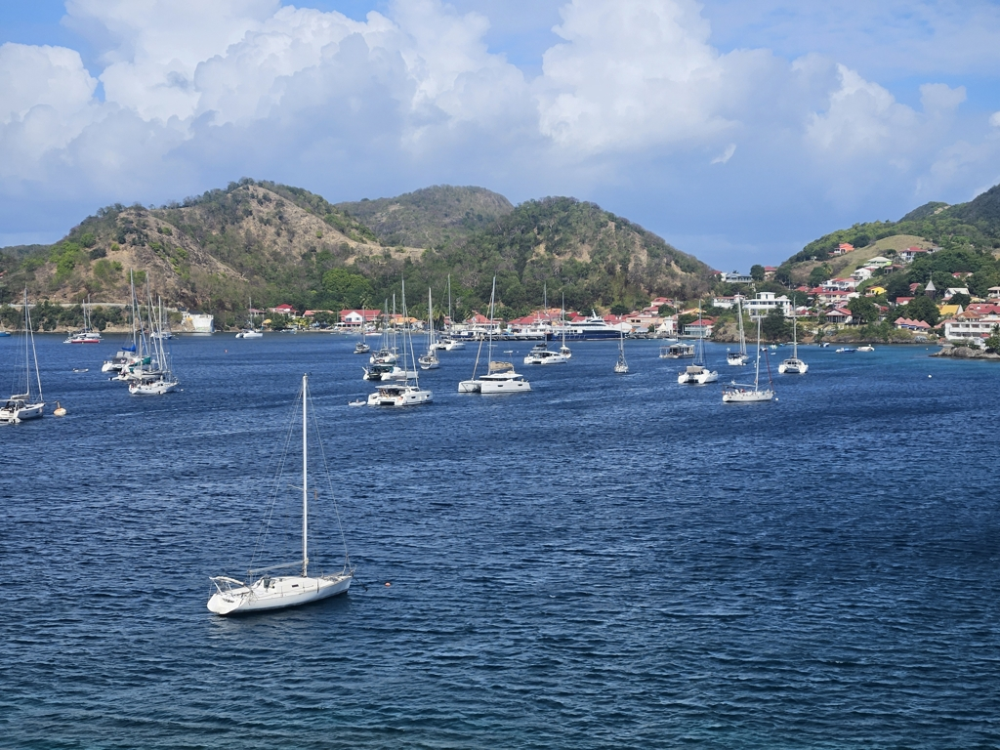

The anchorage just under the fortified cliff of Tete Rouge was a bit rolly, mostly due to the speeding motorboats and ferries. In the morning we started preparing for dinghy deployement in order to have a small land adventure. But as we were clearing the foredeck, we noticed that a lot of the mooring balls next to the town itself were now vacant. And so, anchor up and to the mooring field!

With this move we're now a little bit more protected, and the dinghy ride shrunk from 0.5NM to just some hundreds of meters. This is nice as windy conditions are in the forecast. We went ashore to pay for the mooring, and ran into the crew of _Brimble_, just arrived from Dominica. After some sightseeing they joined us for sundowners on Lille Ø.

* Distance today: 0.4NM
* Lunch: sandwiches
* Engine hours: 0.5
