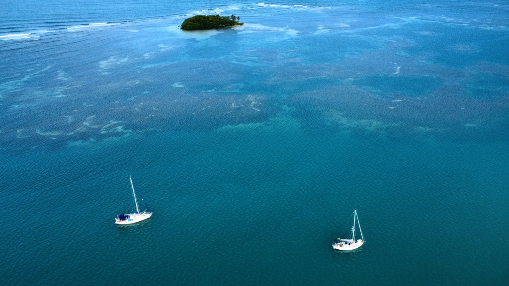

After enjoying the carneval atmosphere in Terre-de-Haut, we let go of our mooring ball after breakfast and took our course towards Basse-Terre. A promise of an anchorage with dead calm waters was appealing to us. So main up in first reef and staysail. 

The wind was lighter than in the forecast, so we put away the staysail and rolled out the genoa and shook out the reef in the main. We made decent progress untill an oncoming squall first sucked all the wind out. That meant that with the swell our mainsail was banging annoyingly around, so we took it down.  After a while as the squall was crawling closer to us we rolled the genoa in significantly.  After a bit the squall and the gusts and heavy rain caught us and we proceeded to get soaking wet. A free shower for us! 

 

Now we are anchored inside the reef. Also on high tide, the reef kills all the swell and for the first time in ages we are absolutely still in the water!

* Distance: 19.1NM
* Lunch: scrambled eggs with vegetables
* Engine hours: 0.6
