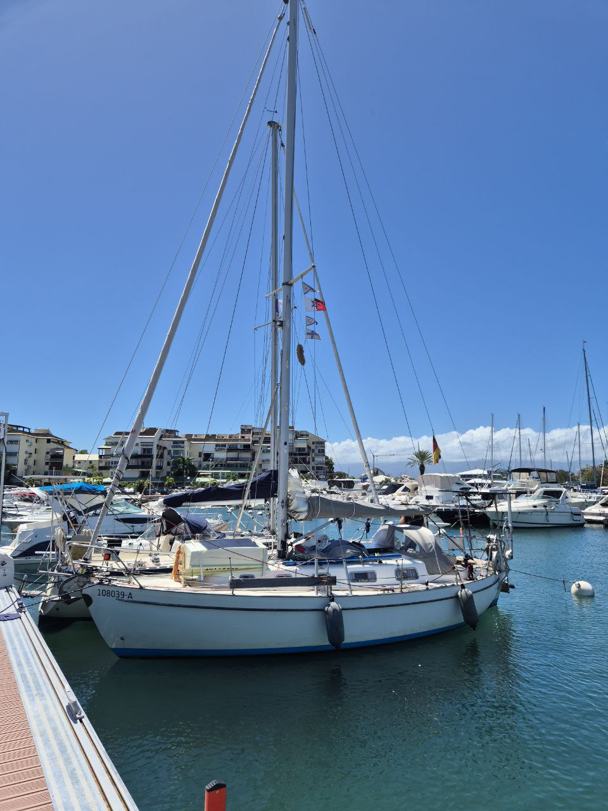

After a night very well slept in the still water, we hoisted the anchor and sailed out of the lagoon.

The winding fairway between the reefs into the Pointe-a-Pitre harbour was marked with both cardinal and lateral buoys. It's been a while we've seen those, and the eye to pick them out of the horizon needed again some training.

Once inside the barrier island, we dropped sail and radioed the marina. They told us to prepare for med mooring with a buoy line. We did so, and then motored on a holding pattern until the harbour launch was done with the previous customer. Amusingly they parked us into the pier for local small motorboats. By Caribbean standards, Lille Ø is tiny!

 

Now to watch the local Mardi Gras parade...

* Distance today: 6.3NM
* Lunch: Colombo with rice
* Engine hours: 0.9
