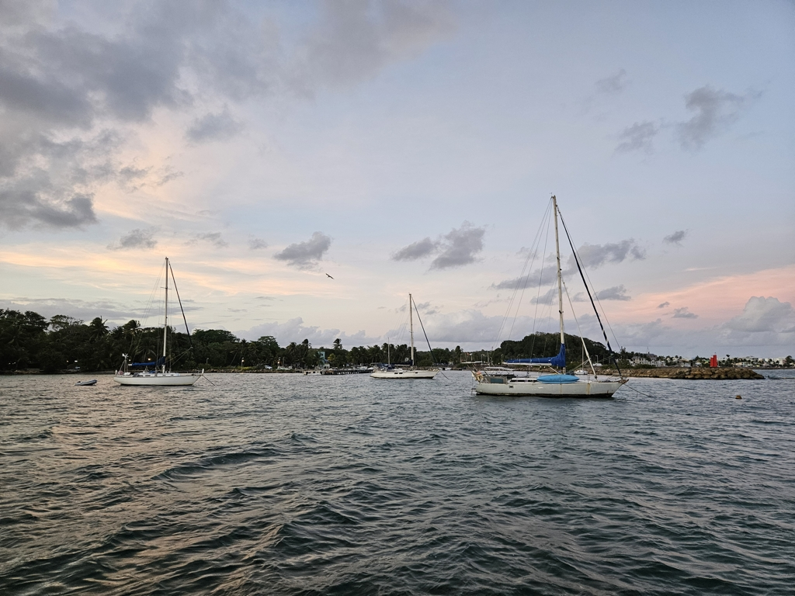

Breakfast of croissants and pain au chocolate on the aft deck and groceries and stowing everything away later we reversed out of spot in the harbour. A tight manouver that with a bit of setting up went flawlessly. It's nice to know that we can still make the tight turns with Lille Ø although we havent needed those skills since last year!

 

The sailing started with beating into the wind and big confused seas of the bay.  After the conservative start with staysail and main in 1st reef we first went to full main and then swapped the staysail to the full genoa. Tacking with the genoa in this kind of a sea state with the inner forestay in place meant that we were doing a Q-wende every time. After we got out of the bay and shallow water the going got definitely better.  

With an hour of sunlight to spare, we reached our destination. Our first option for anchoring was full, so with very careful manouvering we went in closer to the shore. Now we are anchored in 2m of water with our anchor dug securely into the sandy bottom.

 

* Distance today: 17.8NM
* Lunch: feta salad
* Engine hours: 1.2
