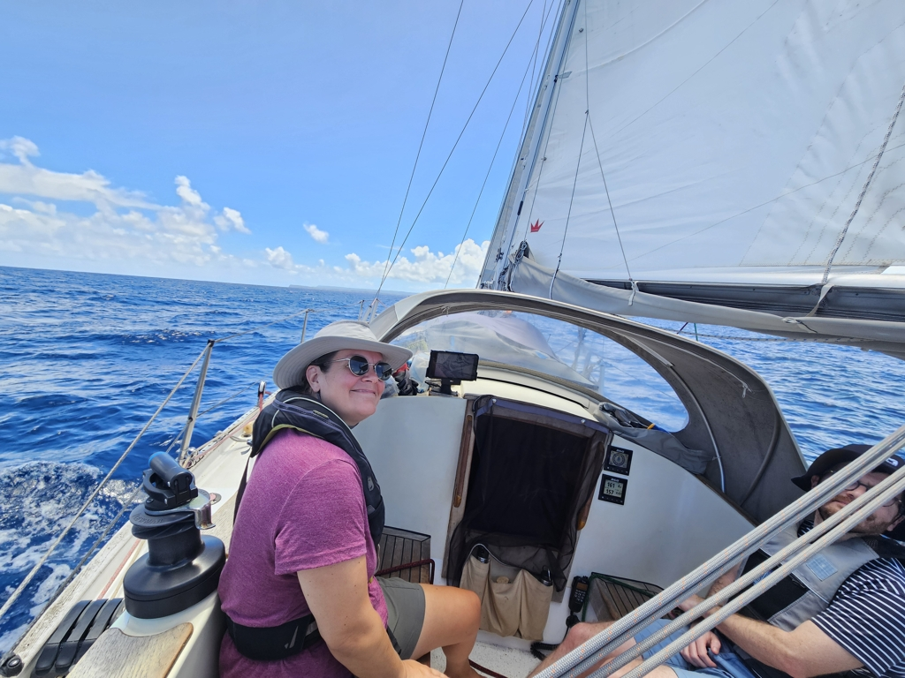

After morning coffee we navigated ourselves out of the reef pass and hoisted full sail. Forecast had uncommonly light conditions.

Yesterday's tacking had won us enough easting that now we could head directly towards Marie Galante on a close reach. A lovely sail with big but gentle Atlantic swell, and wind ranging between 8kt and 15kt.

 

As our intended anchorage was packed quite full, we instead dropped the hook to the one just upwind. Plenty of space in turquoise waters. There is a small island protecting it, but some swell still makes it in. But not too bad. Now for a swim!

* Distance today: 15.3NM
* Lunch: chanterelle quiche
* Engine hours: 0.6
