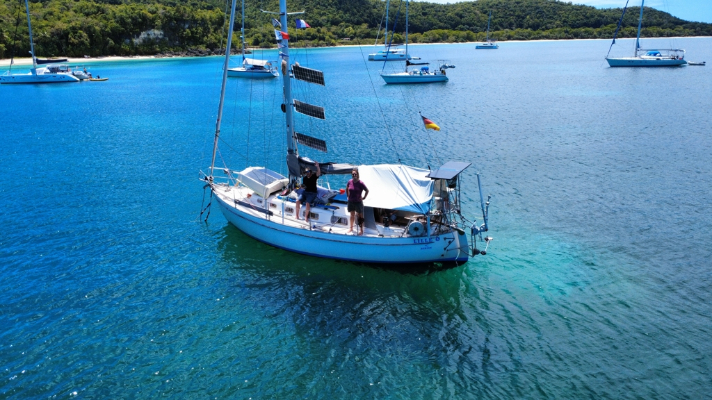

The anchorage was pretty rolly, so we decided to try our luck around the next cape in the morning. We motored the half mile after observing that few boats had left the anchorage making space for us.

 

After rounding the cape we chose our spot close to the steep cliffs and dopped the hook at first we missed our sandy patch and needed to hoist the anchor as it was not biting in through the thick sea grass. At the second try we got the anchor properly dug in. Now we are looking for a day of swimming and snorkeling.

* Distance today: 0.6NM
* Lunch: spaghetti aglio e olio
* Engine hours: 0.5
