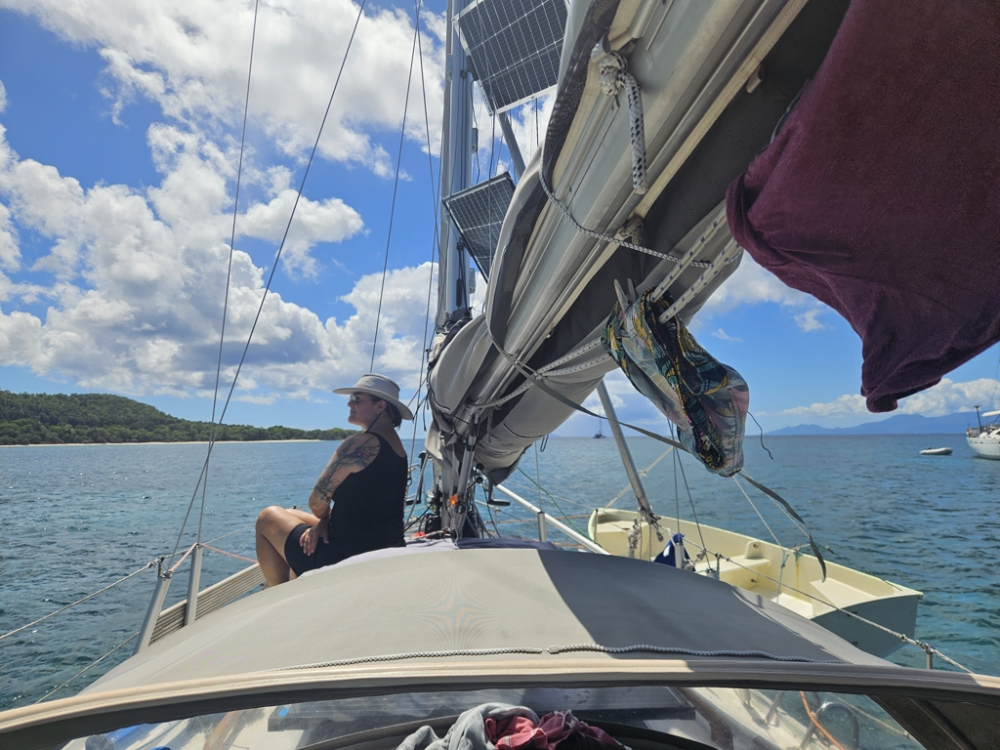

We had a nice hike, a swim in among the mangroves, and finally some snorkeling. But as we need to check out of the country tomorrow, we decided to move to the anchorage in front of Saint-Louis.

 

We hoisted anchor and motored around the corner. Everywhere around this island appears to be good anchoring depths, and so we picked another nice sand patch. Tomorrow for some more inland exploration!

* Distance today: 2.1NM
* Lunch: Couscous salad
* Engine hours: 0.7
