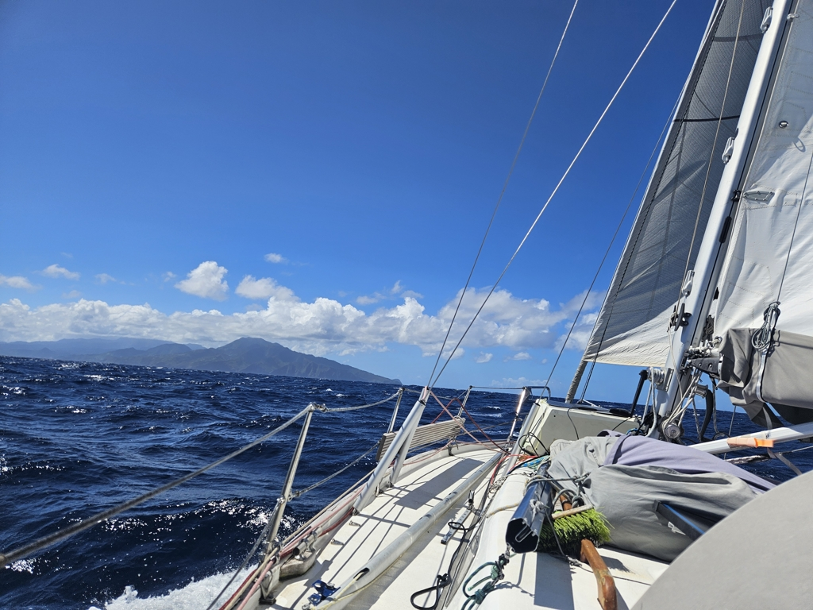

We woke up with the sun and hoisted the sails after a quick breakfast. The forecast promised variable winds on the beam, so we opted for a mainsail in first reef and genoa that we ended up reefing and unreefing many times.

 

As we were sailing off we heard a pan pan over the radio. A Polish ship had engine trouble and were using their emergency steering and required towing help. Too far for us to help. What made the following conversation a bit funny to hear was the pleas to speak english when the operator was speaking english... A stressfull situation clearly for the boat and as of now we can see that they got the help they needed and are safely in the harbour.

Our day continued with a pleasant beam reach with various amounts of genoa out.  Depending on the squall we had either a sliver of sail out or nearly full sail. 

Now we are again checked in to Dominica and finally met again with our buddy boat Tyrik! We'll have dinner over there and make plans for the island time tomorrow.

* Distance today: 25.9NM
* Lunch: gazpacho 
* Engine hours: 0.8
