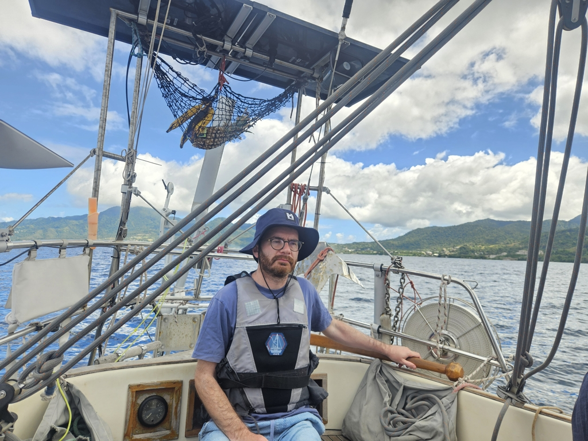
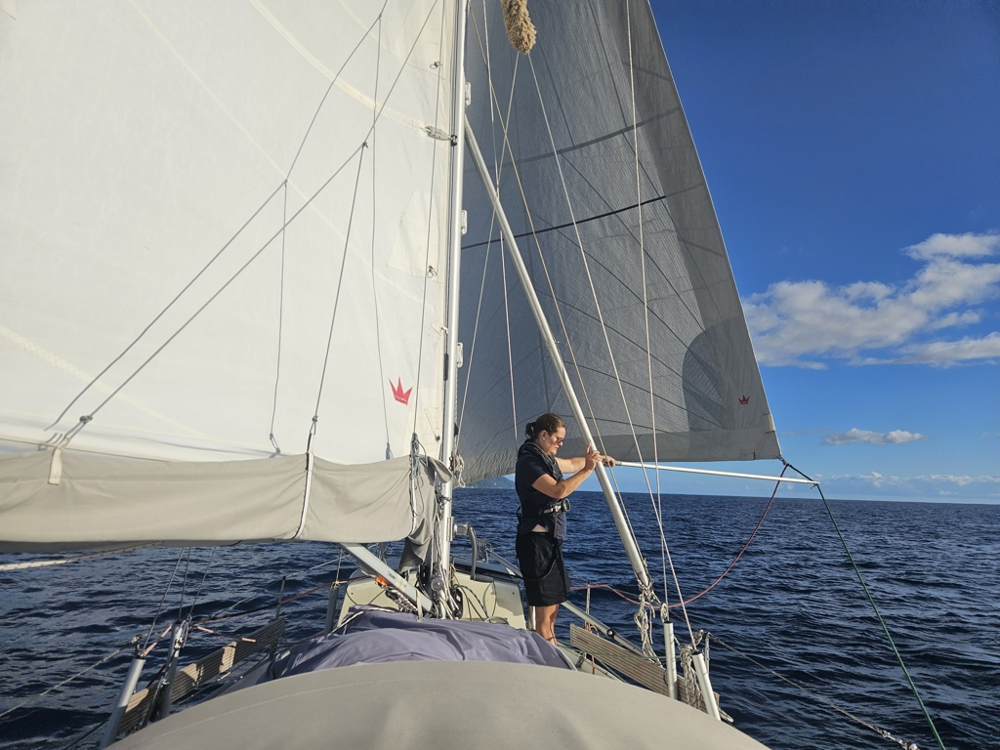

After exploring the ruins of Fort Shirley, we woke up at night to observe the lunar eclipse. Then in the morning plan was to hoist anchor and head south.

However, we couldn't get anchor up past the 20m chain marker. We were stuck! Suski donned her snorkeling gear and jumped in to check the situation. As we had been swinging at anchor, we had wrapped the chain around some debris in the bottom. It took us 40min, but Suski was able to direct us through the necessary turns to unwind and free ourselves.

 

What followed was another "Havel sailing day". Light winds and easy seas allowed us to drift past most of Dominica as a leisurely pace.

 

Now we're anchored again just outside the capital of Roseau. Lots of the interest nature sites are nearer to here, meaning we won't need to spend so much time on the bus.

* Distance today: 18.4NM
* Lunch: vegetable wraps and fruit salad
* Engine hours: 1.5
