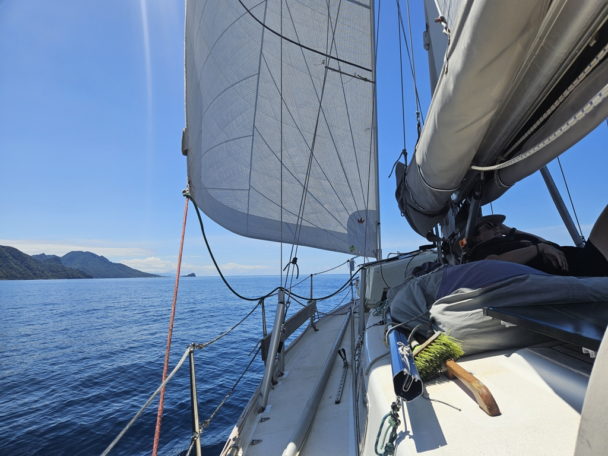
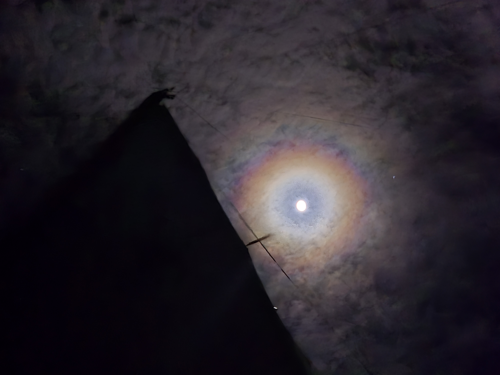

With sore muscles we woke up to a new day. The hike to Boiling Lake was still fresh in our minds as we hoisted the anchor just after eleven. There was no time to rest as a week of southerlies is looming ahead. So we took the little wind that was in the forecast and hoisted full genoa and main.  Behind Dominica we were sailing ever so slowly with a bit of see breeze. Just before the cape the wind got so confused that we motored a bit.

 

Between Dominica and Martinique we got to sail a  perfect beam reach with around 12 knots of wind. At the northern cape of Martinique the wind increased to 20 knots for a bit, but with a small reef in the genoa we flew forward.  As the cape efect was over, we went back to either sailing forward with 1 knot of speed or 5 knots, depending in what mood the wind was on. And occasionally we would motor a bit to reach the next windier area.

 

As the sun was rising we passed HMS Diamond Rock once more and were on the home stretch for Sainte Anne anchorage where we'll drop Bernhard off.

* Distance today: 67.3NM
* Lunch: macaroni casserole
* Engine hours: 2.1
