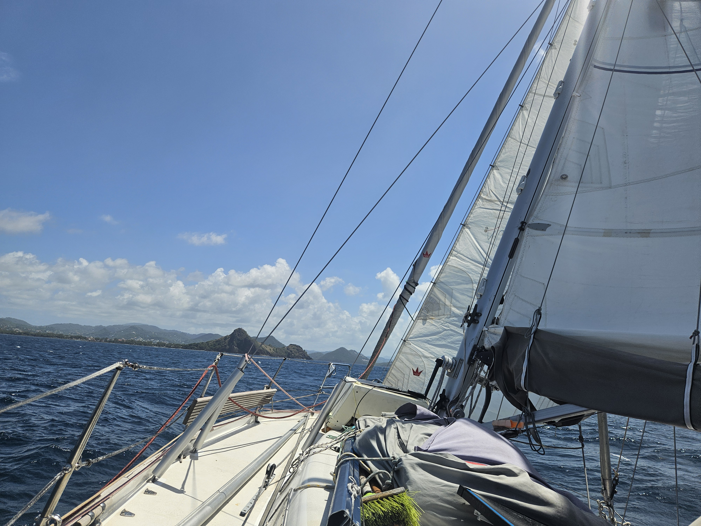

Since we were in France, the morning started by rowing to the bakery to get some fresh croissants. Then boat ready, anchor up, and underway.

The Saint Lucia channel was a bit rolly but fast beam reach, with winds ranging between 16 and 23kt. This made it easy going with the staysail and main on 1st reef.

 

We dropped sail after rounding Pigeon Point. Our first anchoring attempt kept bouncing, likely on some rocks. But 100m further towards the shore the holding seems perfect.

After a 0.7NM dinghy trip to the local marina, we are now cleared in to St. Lucia.

* Distance today: 22.8NM
* Lunch: feta salad
* Engine hours: 0.7
