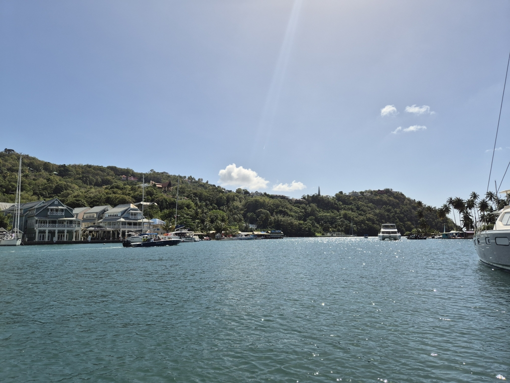

Today's big mission was to fill up the diesel tank. We hoisted anchor and motored through the small canal to the harbour basin. The fuel dock was an easy approach with plenty of space to manouver. We filled up 50 liters, which means that since Lanzarote we have used 50 liters of diesel. Not bad for 5 months of cruising!

 

After filling up, we hoisted the main in first reef and shot out of Rodney Bay with 20 knots of wind behind the beam. After turning the cape we rolled a sliver of genoa out. The wind gusted to 30kn at times but the conservative sail plan made the sail enjoyable. After only bit under two hours, we were at our destination, Marigot bay. We decided to bite the bullet and take one of the mooring balls on the inside lagoon. There is some magic in this tiny hurricane hole!

 

* Distance today: 10.1NM
* Engine hours: 1
