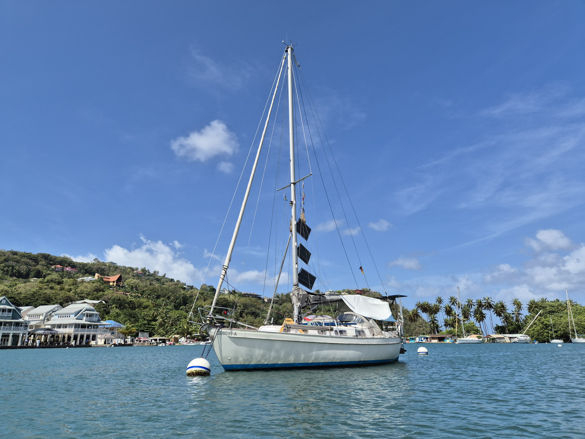

After a quiet night in the protection of the mangroves, we went ashore to enjoy another pleasant marina shower. Then we left the mooring ball and headed out.

 

Conditions were again quite blustery, with winds ranging from 1kt to 32kt, sometimes in seconds. Yet we managed to sail most of the way, until wind died completely just before the Soufriere Bay entrance.

We motored the rest of the way. This is a marine reserve, and anchoring is forbidden in the most of it. The depths would also make that complicated. And so we're on a mooring ball right in front of the town, with a great view towards the Petit Piton behind us.

 

* Distance today: 9.3NM
* Engine hours: 1
