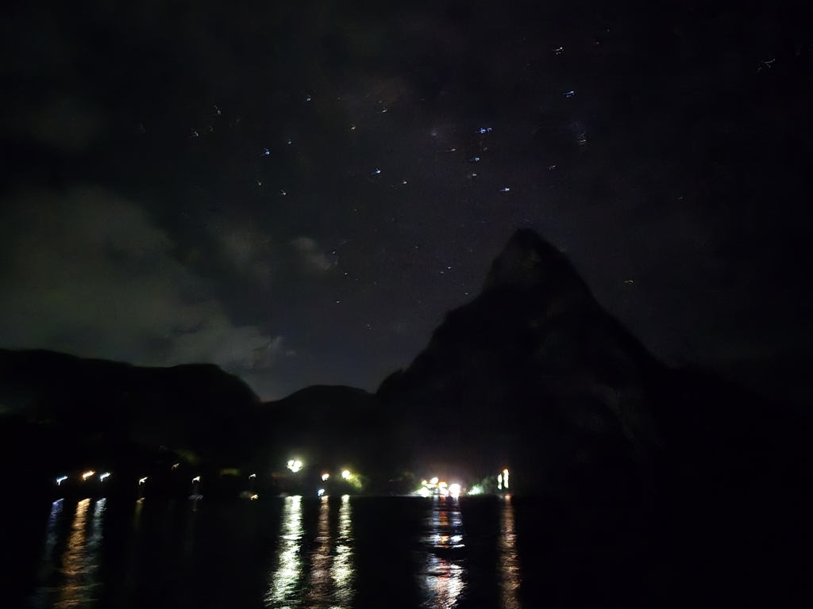

We left well before dawn in the hopes we would arrive before the immigration closes. We knew we were in for a bit of motoring but we were not prepared for the winds ranging between 0 and 32 knots and somehow we had forgotten how much the current running against us is. So we left with what we soon realized to be too late to arrive for immigration or even in daylight.

We kept changing from first to second reef, from staysail to genoa and to motor on and off. The squalls could propel us fast forward,  the conservative sail plan made us slower, the motor can only give 5kn of speed through water (I don't like to make the poor thing scream), so slowly but surely our estimated arrival time kept slipping away.

As the darkness fell, we were 1 hour way from the anchorage,  we slowly motored in checking for a empty looking spot. It helps a ton that we have already been here twice, so even in the darkness we could find our bearings. Now we are very far away from everything, but this we can easily fix tomorrow when we can actually see something. Today's mission was to arrive and anchor safely, tomorrow well deal with getting us a shorter distance to row.

* Distance today: 55.8NM
* Lunch: lentil coconut curry
* Engine hours: 6.8
