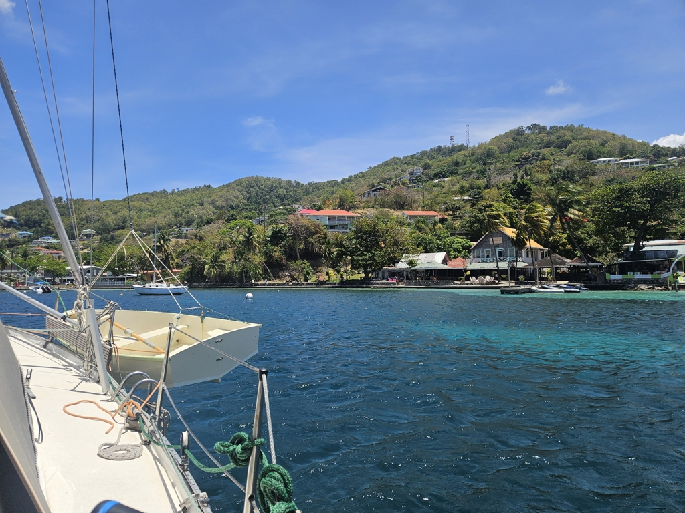

After morning coffee we assembled the dinghy. Always a bit sporty in the high winds! Then the refreshing 0.7NM upwind row to the customs dock.

Once we were cleared in I sought out the "boat boy" we had dealt with last time when we were here. She was able to offer a good deal on a mooring for the week, and so we hoisted anchor. We're again moored right in front of the Whaleboners dinghy dock. This place is far more sheltered than the anchorage, and we have a very short row to town. Now we can enjoy some island time and do some boat projects over the very windy week to come.

* Distance today: 0.5NM
* Lunch: spinach pancakes
* Engine hours: 0.3
