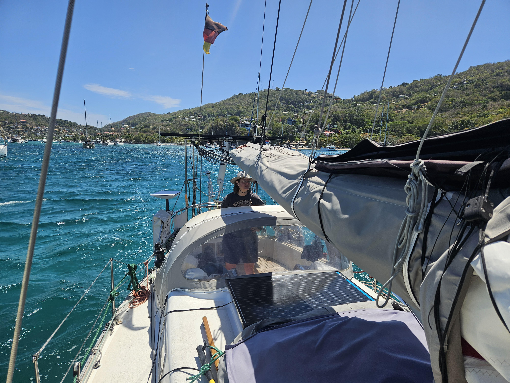

The week on the mooring ball came to its end. As we didn't get the boat quite as ready as we wanted on Friday we moved to anchor. But the reason for the slight delay in preparations was the best. We finally spent time with the crew of _Belafonte_, who we met for the first time way back in Stavanger. 

 

We tried anchoring in Princess Margaret Bay, but  it was too congested.  So we ventured even further out to Lower Bay. Here the swell is bigger, but there is plenty of space to swing around in the 25kn gusts.

* Distance today: 1.1NM
* Engine hours: 0.9
