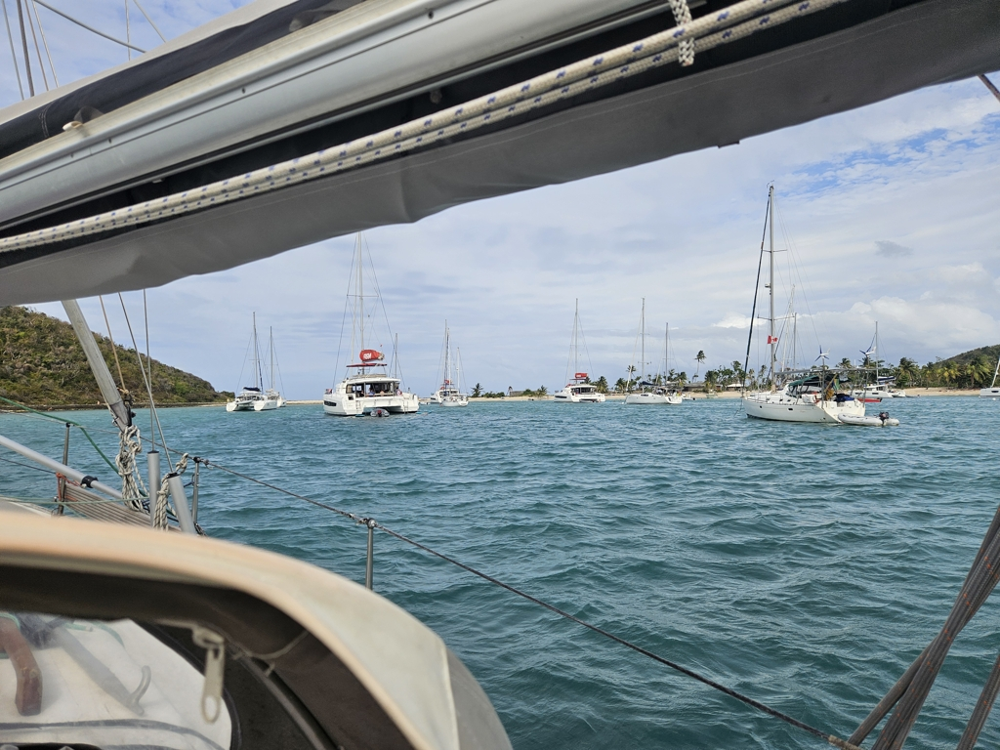

This morning it was finally time to pack the dinghy and head south. Forecast promised a bit lighter conditions for the next couple of days.

Leaving Bequia, we still got some 28kn gusts at the acceleration zone. But otherwise the sail was quite nice broad reach. We made some water, and enjoyed looking at the islands on the way.

In the afternoon we arrived at Mayreau. Salt Whistle Bay is quite packed with charter catamarans, but we managed to find a place to anchor. It is quite rolly, so depending if we get a better spot tomorrow morning, we might move to the other end of the island. Here the distances are short.

 

It should be noted that we left our home port of S.C. Gothia in Berlin exactly a year ago. The European part of this adventure, from Norwegian fjords to the Scottish islands and the Spanish Rías feels quite far away.

* Distance today: 25.1NM
* Lunch: lasagne
* Engine hours: 0.3
