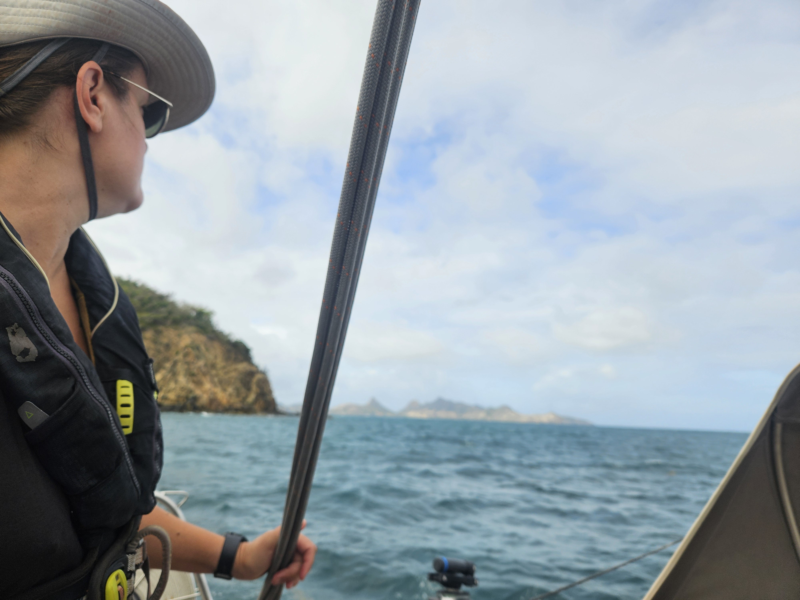

After coffee it was up with the anchor. In Salt Whistle Bay all the good spots are taken by mooring balls, so we went looking for a bit more comfortable anchorage. We motored the 1.2NM to Saline Bay. Here we have more space, less swell but the wind is howling through without obstructions.

 

It has been pretty windy recently, so we haven't been able to use our flinsails, which means that we are a bit low on power. A kindom for a wind generator that fits in a 'spitsgatter'.

* Distance today: 1.4NM
* Lunch: bibimbap
* Engine hours: 0.5
