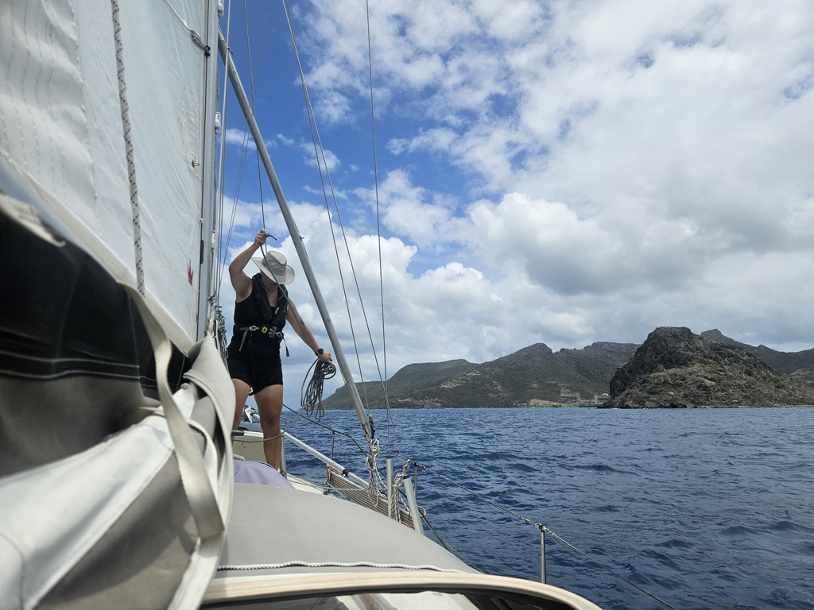

After morning coffee and preparing a sourdough, we hoisted anchor and set sail to the next island over. We will eventually need to clear out of St Vincent and the Grenadines here.

The sail was short, but a pleasant one at beam reach with full sail up. We arrived to the lee of the small Frigate Island and the ruins of the superyacht marina just as sky turned grey. Anchor was set and boat made ready before the first squall hit us. Oh well, maybe we'll wait a bit before deploying the dinghy.

 

* Distance today: 5.6NM
* Lunch: stovetop pizza
* Engine hours: 0.4
