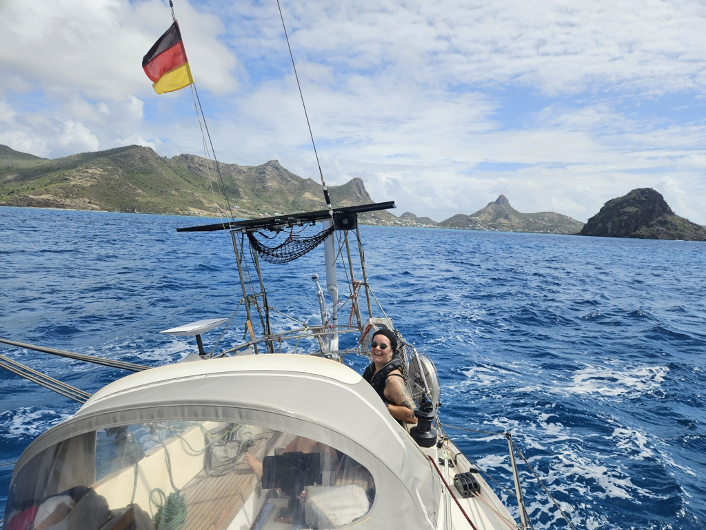

We cleared out already on Tuesday, so today we just needed to pack the dinghy and hoist anchor and sails. We opted for main in first reef and genoa partially rolled in. The sail was fast and smooth. The reefs were protecting us from the swell the whole way.

 

As we turned to Tyrell Bay we got smacked with a gust of 33 knots, we opened the main a bit to smoothen the heel and proceeded to drop sails after the gust was gone. Now checking in to Grenada and 'anlegers' of Carib, kippis Kari!

* Distance today: 9.5NM
* Dinner: prawn pasta
* Engine hours: 0.7
