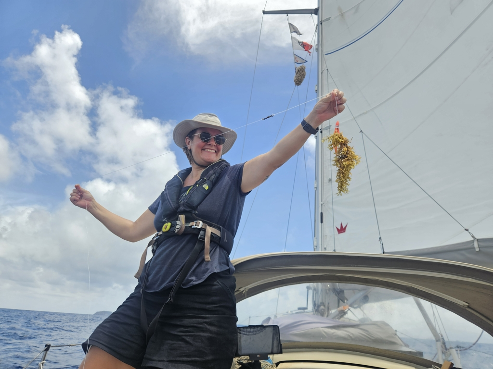
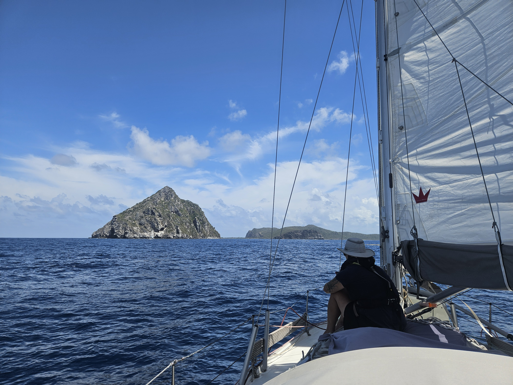

A rarity in the forecast, a couple of days of calm! So to capitalise on that, we decided to sail over to the uninhabited Ronde Island. The anchorage is not particularly well protected, but with the calms, it should offer could snorkeling.

And so, after some Easter video calls, we hoisted anchor and set sail south.

 

What followed was a slow but pleasant sail on a beam reach. Full sails up, another rarity in these waters.
With the light winds and strong current, most of the trip went on a "crab walk", pointing some 30° off our target.

 

Now we're anchored off Ronde Island with a couple of other sailboats. Suski already went snorkeling, and I'm also due for a swim soon. The day is hot!

* Distance today: 11.5NM
* Engine hours: 0.6
