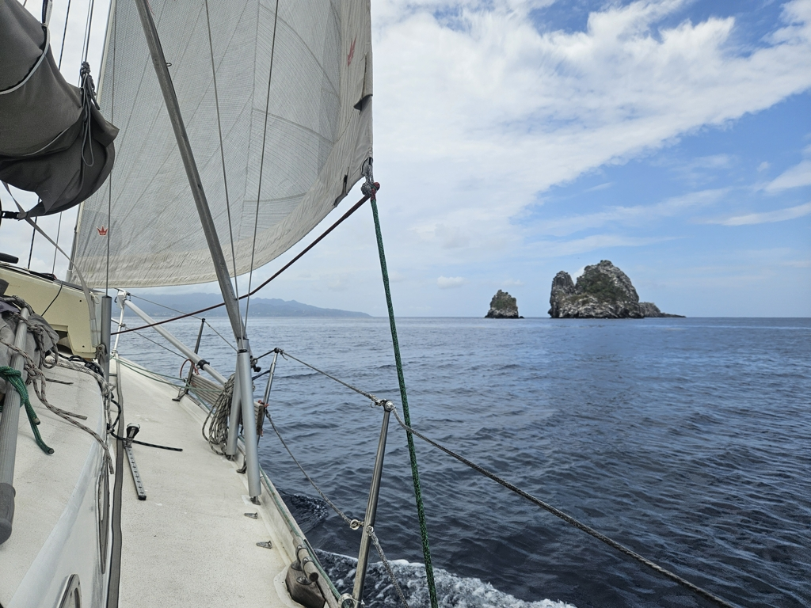
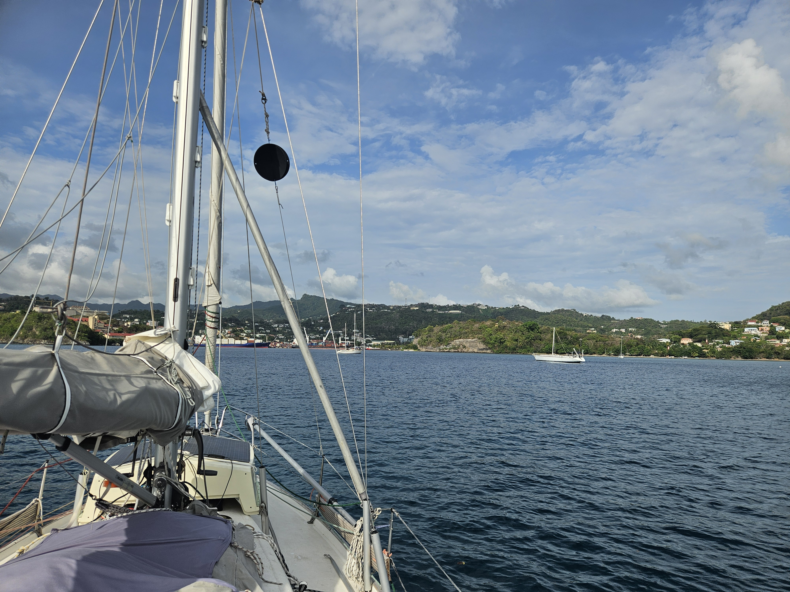

After a couple days on the deserted island, it was time again to seek civilization. We hoisted anchor and headed across to the main island of Grenada on a fast beam reach. Suski scrubbing the bottom clean had a clear effect on the boat speed.

 

As always, the winds were more fickle in the lee of the island, and so we had to motor some bits amid a thick layer of sargasso seagrass.

We dropped hook in the anchorage outside of St. George's. The depths here require lengths of chain we've hardly seen since Scotland. But better to stay on our own hook than trust a mooring.

 

Kippis, Stefan, Arlette & Gizmo!

* Distance today: 23.5NM
* Lunch: cheese and vegetable wraps
* Engine hours: 2.5
