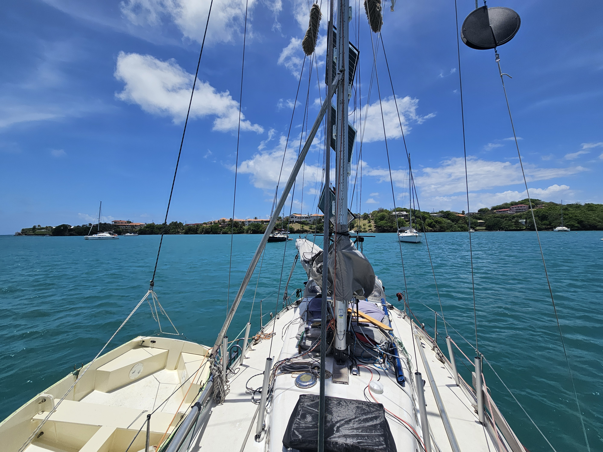

Yesterday we got an big upgrade to our setup. Isosaari now has an electric engine! A ePropulsion Sprit 1.0 Plus.  Now we have about 7.5 hour run time at 3 knots of speed. This will give us plenty of opportunities to do some dinghy sightseeing.

 

In the morning we lowered the dinghy, put on the outboard, and went to get some freshies from the farmers market. With the distance being over a mile we wouldn't have done it with rowing. Bag full of fruit and vegetables we got back to the boat, packed the motor and dinghy away and hoisted anchor. We decided to motor the way as we had made a sizeable dent too our battery levels by putting together this month's YouTube video on a rainy day.

The way over was at first pleasant in the protection of the bay and slightly uncomfortable after rounding the Point Salines. Prickly Bay is very crowded so it took us a while to find a proper spot to anchor. Now we are securely anchored and ready for some land adventures.

 

* Distance today: 7.4NM
* Lunch: feta salad
* Engine hours: 2.1
