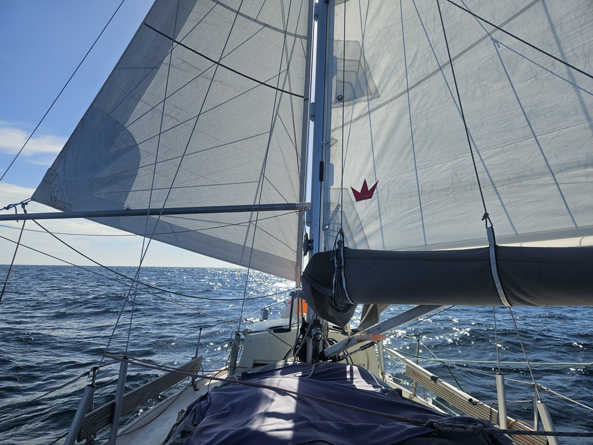

Two weeks went by quickly enjoying the sights and the cruiser community of Grenada. Having cleared out the previous evening, we waited a morning squall to pass and then hoisted anchor.
The murky waters of Prickly Bay ensured that the chain came onboard with a thick coating of seaweed. So, some scrubbing and under way!

It was fun to make the boat again offshore-ready after such a long time coastal sailing. As we're again on a downwind passage, we got to pole out the genoa.

 

Waters were a bit rough just west off Grenada where two currents meet, but the sea state mellowed after getting beyond the Reindeer Shoal (something named after reindeer, here?). This would be perfect Parasailor conditions, if it weren't for the cumulonimbus lurking in the horizon. But lovely to be again on a passage.

* Distance today: 30NM
* Engine hours: 0.4
* Lunch: salad
