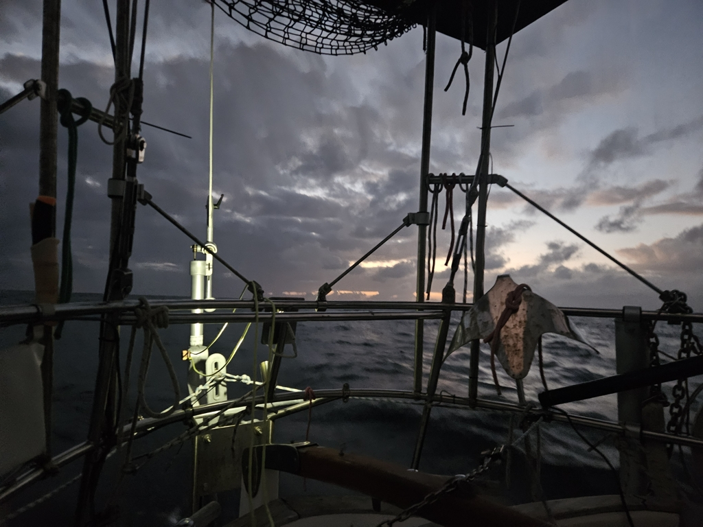

Sea state made the night a  difficult one to sleep. The bane of first night on a passage, hunting down warious objects making noice in the cabinets kept us entertained. So Suski stepped into her morning watch with only few blinks of sleep. 

Misbehaving windvane made sure that it was impossible to fall asleep on watch. Bergie got some hours of sleep on his off-watch, so he took over the watch duties at noon and Suski promptly fell asleep like a log. 

 

Now we are hopefully settled back to our routine. 4 months of day sailing and we are clearly out of practice in passage making.

* Distance today: 116NM
* Engine hours: 0
* Lunch: spaghetti with tomato sauce
