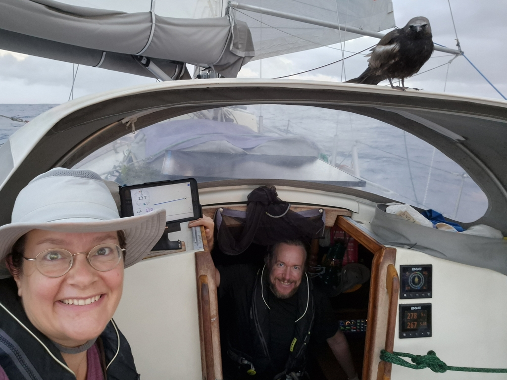

Around sunset we got a visitor - a brown noddy flew over, and after a few attempts managed to land on our sprayhood. There it stayed, not particularly interested in our comings and goings. And then left a bit after sunrise.

 

Today we've had a pretty fast ride. The wind angle is not perfect for our route, and so we're getting pushed a bit further north than planned. But that's fine, it is anyway better to give Venezuela a wide berth.

 

The afternoon was pretty much perfect ocean sailing. Windvane steered happily on its own, and the boat ventured further west on a deep blue sea. And apart from some short drizzles, the sun has been shining, and the crew has managed to sleep.

* Distance today: 150NM
* Engine hours: 0
* Lunch: stovetop pizza with olives
