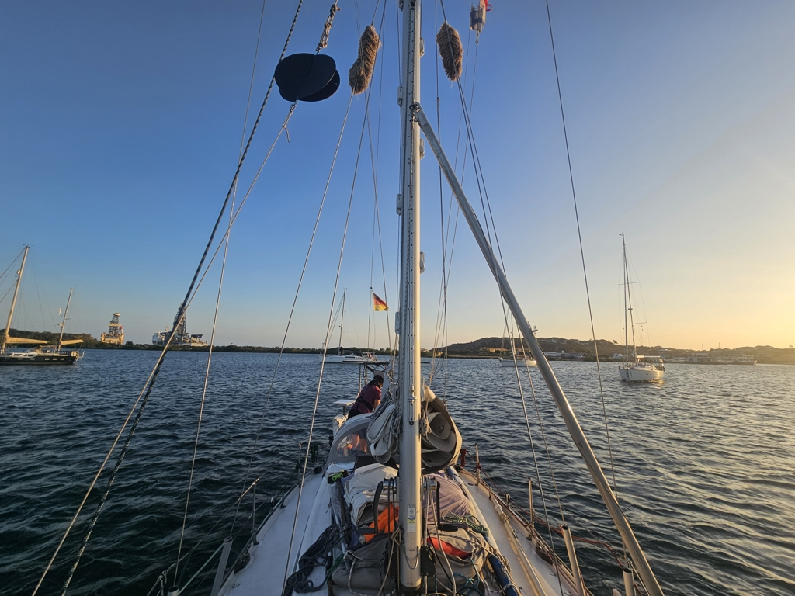

As the night fell, we got again an extra passanger in the form of a brown noddy. We made good progress in the night, averaging 6.6 knots! The rolly conditions meant that from time to time, the noddy fell off from the sprayhood and needed to catch us again and find its seat.

As the dawn broke, we were 65 miles away and arrival on Tuesday evening seemed possible! So we mustered all of our regatta skills and set on the hunt for the narrow strait leading to Spanish Water. We arrived with an hour to spare! Which was good as there is plenty of stones and shallows along it and we still needed to find our anchoring spot. 

 

Now the boat is ready for the night. We'll stay here for at least the next three months and get some boat projects done. The sailing season goes for a break to get us acclimatised to the hurricane season starting in June. Kippis Karin and Daniel!

* Distance today: 146NM
* Engine hours: 0.9
* Lunch: shahi paneer
