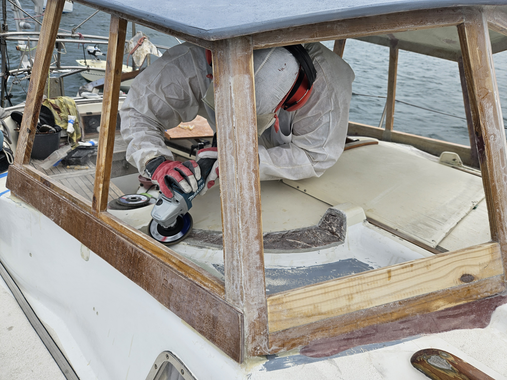
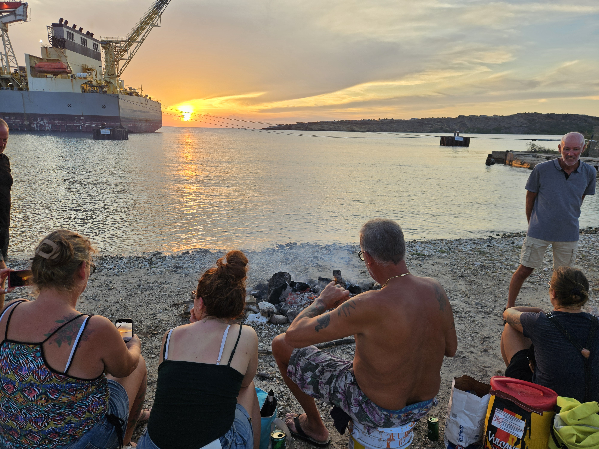

The saying goes: when the ToDo list for your boat is empty, it is time to sell the boat because you clearly don't love it anymore. No fear of that for us in the hot climate of Curaçao. In the past five months, Lille Ø has undergone a major transformation. The biggest undertaking we took was to build a hard dodger instead of the sprayhood that was quickly falling apart in the unforgiving bombartment of tropical sun.

 

While in Curaçao we finished the following projects:

Structural / hard dodger

- Moved bridgedeck higher by 20cm and shortened the lower washboard 
- Built a cockpit box for the liferaft
- Removed teak deck from hatch garage
- Glassed the front part of hatch garage shut
- Built a hard dodger
- Installed gas struts for the hard dodger safari window
- New custom sun tarp between the hard dodger and the solar arch
- Custom 3D printed solar panel mounts for the hard dodger
- Added amber LEDs outside the dodger for improved visibility at anchor
- Built a center console above the companionway for instruments
- Added amber LED behind the center console for mood lighting
- Set up a kitchen garden under the dodger
- Fabricated and installed new external chainplates for the aft stays
- Glassed the old instrument mounting holes closed
- New aft stays with sta-lok fittings

Electrical refactoring

- Moved autopilot controller to the aft end of the cockpit and simplified wiring 
- Installed new cable channels between hanging locker and the head
- Installed new cable channel between hanging locker and the battery compartment 
- Installed new cable channels between hard dodger and technical compartment
- Moved FLINsail and bow panel MPPTs to the hanging locker
- Upgraded aft arch MPPT controller to 100/30
- Upgraded bow panels to 2×100W bifacial
- Upgraded stern arch panels to single 300W bifacial
- Installed the 2×120W panels previously on stern arch on top of hard dodger
- Installed rigging-suspended Superwind 350 wind turbine
- Added Shelly relays to turn NAS and info display on/off
- Added fixed 12V charging station for the Dyson vacuum
- Added fixed 12V charging station for the handheld VHF
- Added fixed charging station for two T1000-e Meshtastic trackers
- Switched info display to be powered by a SH-RPi hat

Communications

- Installed a Meshtastic node for the boat, with telemetry and alerting sent to crew nodes
- Installed a solar-powered Meshtastic node on the mast for increased communications range
- Wall mounted the logbook printer
- Installed LoRa APRS iGate on the boat
- Installed Icom IC-718 HF radio with an antenna tuner and a SignaLink sound card

Interior and comfort

- Installed a latch for the bar cabinet top lid
- Custom 3D printed a cork for freshwater canisters during water making
- Built a wind scoop for the forward hatch
- Added a shoe bag for the deck
- Homebrew setup for making ginger beer
- Installed air-only dorade vents for the saloon

Dinghy

- Built a new standing lug rig with carbon fiber mast
- Built a deck bag for the new rig
- Installed a Meshtastic tracker for the dinghy

Software

- Built a new plugin for integrating Signal K with the Meshtastic LoRa mesh network
- Built a new plugin for raising Signal K alerts for discovered MOB beacons
- Built a new plugin to combine values from multiple Signal K paths
- Built a new plugin to compute the Maidenhead locator for the vessel

Fixes and maintenance 

- Sent mainsail for maintenance 
- Replaced sheared bolt on the Watermaker body
- Replaced broken USB-C power outlet in saloon
- Tightened loose mast top wind indicator
- Rewired anchor light that had a bad contact
- Fixed broken FLINsail mast slider
- Replaced broken Superwind blade
- Replaced fridge compressor and evaporator
- Re-soldered broken galley light
- Replaced failed DC-DC converter on the info display monitor
- Changed blown fuses from the hydrogenerator controller
- Rewired aft navigation light that had a bad contact

The ToDo list has now been depleted, but it is not empty. The first tasks of things to do when certain parts come available with a reasonable price are already waiting.

Spanish Water has had a quite fun cruiser community, with plenty of activities from beach bonfires to wing foiling and pizza cookouts. But as the hurricane season winds down, the boats are starting to scatter towards all compass directions.

 

The forecast looks light, but that is how we like it for the first sail with the improved version of Lille Ø.
