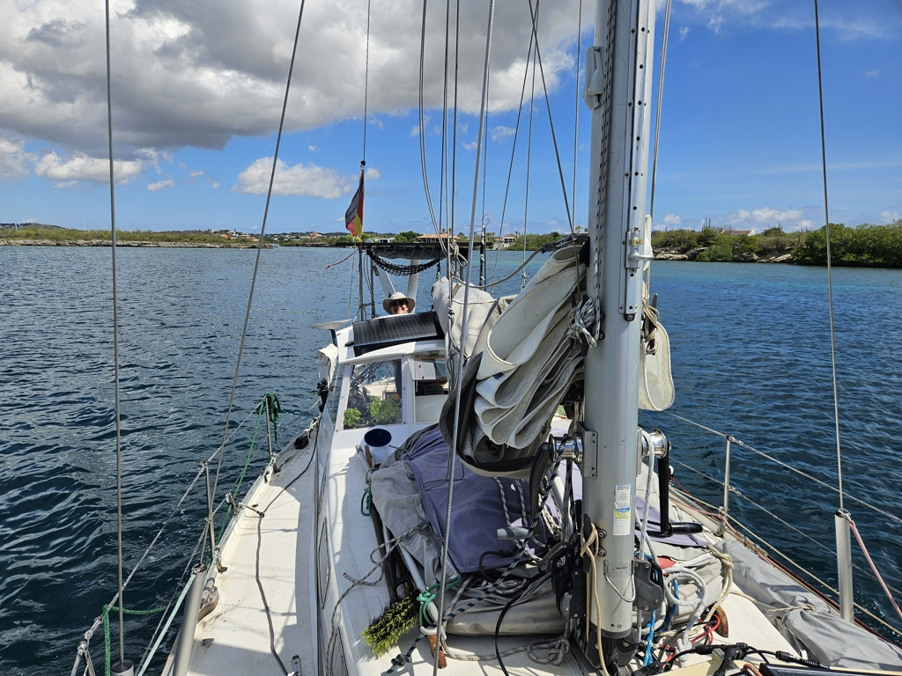
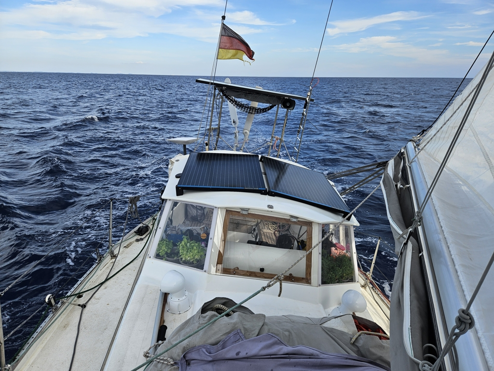

The day started with making the boat sailing ready. Even though we had already few days ago started stowing everything to its correct place, there was still a myriad of things to do. After such a long break we were glad of our checklists to support the poor little brain struggling to change from a land lubber back to a sailor.

As we were through with the list Henry and Adele from _A Touch of Destiny_ came by with a pot of coffee and four cups. "This is a mandatory coffee break time" they proclaimed. And what a good idea it was to have a nice little break in the midst of the preparations. 

And then, we were so far. It was time to hoist the anchor! Our trick had worked ok, the anchor was not quite as full of growth as on Monday when we let out seven more meters in hopes of the chain rattling against the sandy bottom would rub itself clean. 

 

As we waved our goodbyes to Spanish Water and the friendships we have created during this time, we were off to the sea again! We were greeted by a glassy calm see with just enough of breeze to sail, so we could hoist the main and roll out the genoa and enjoy the first miles of sailing in a loooong time. 

Later the wind dropped down to next to nothing , so we motored for four hours.

While motoring, a pod of dolphins came to inspect the miracle of Lille Ø on the move. Now we are sailing to the sunset on a beam reach after a lovely dinner trying to find the sea legs that have clearly fallen asleep in Curaçao.

 

Kippis Bernhard and Allison!

* Distance today: 35NM
* Engine hours: 4
* Lunch: spaghetti with avocado sauce
