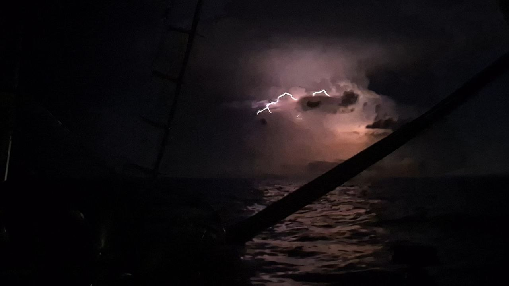
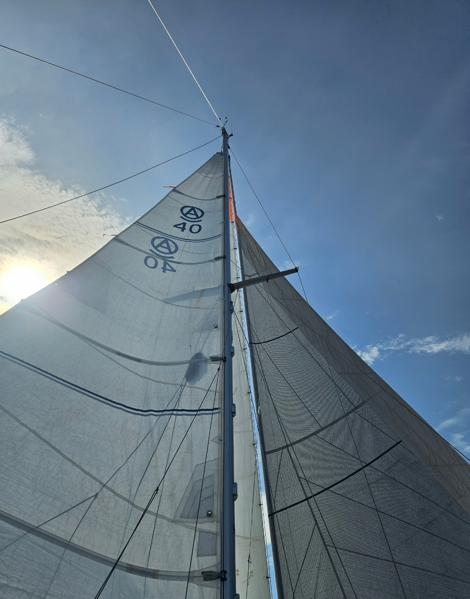

The pleasant sailing conditions carried on until midnight. At that point, the ominous flashing in the horizon caught up to us, and the thunderstorm delivered a whopping 45kt gust. Thankfully, the genoa had already been rolled away as precaution, and the mainsail was reefed.

The pleasant sailing conditions carried on until midnight. At that point, the ominous flashing in the horizon caught up to us, and the thunderstorm delivered a whopping 45kt gust. Thankfully, the genoa had already been rolled away as precaution, and the mainsail was reefed.

 

After a very wet sail stowage operation, we proceeded motoring west. There was intense lightning all around, but none came directly above us. But they did steal our wind.

And so motoring continued in nearly millpond conditions. In the morning, a pod of dolphins came to see us. This time stayed for quite while, playing in our bow.

Finally, just before noon, the wind picked up enough to sail. Now, we are passing by the northernmost cape on Colombia under wing-on-wing, with a speedy current powering us along.

 

* Distance today: 120NM
* Lunch: feta salad
* Engine hours: 12
