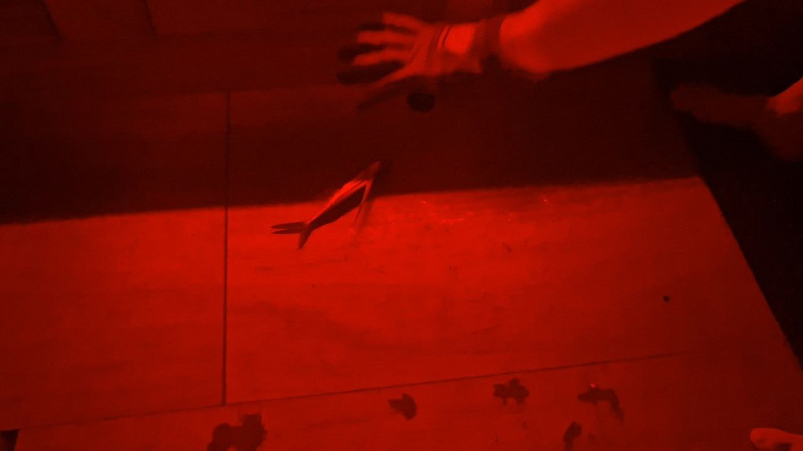
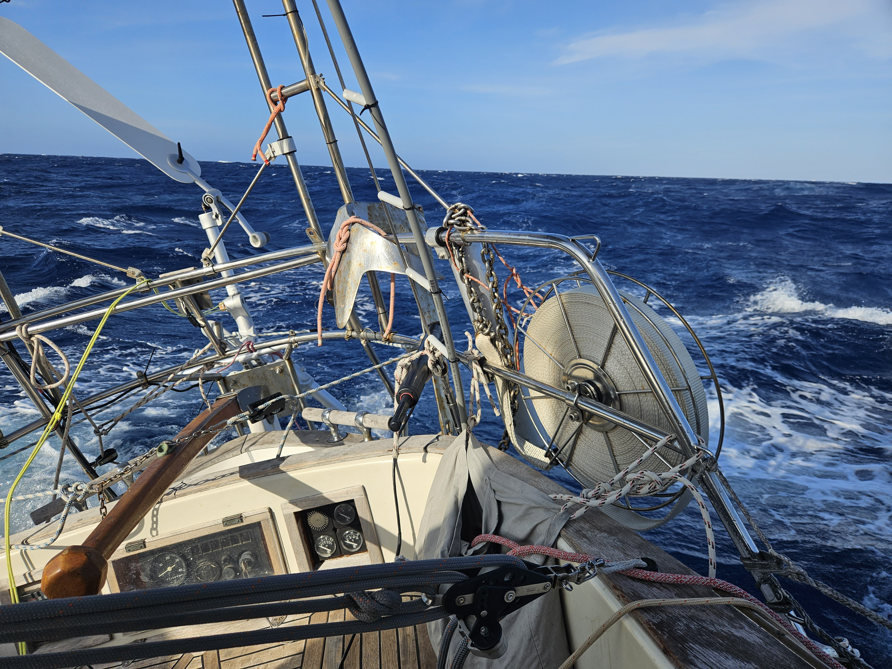

As the night came we prepared for increasing winds by putting a second reef in the main. The night flew by with the wind pilot steering us reliably. 

The night was dark and filled with flying fish going everywhere. TWO even managed to fly straight in from the companionway. It is a weid wakeup when a fish is flapping on the floor next to your bed.

 

The current is still pushing us a long making this a very fast day.

* Distance today: 145NM
* Lunch: lentil coconut curry
* Engine hours: 0
