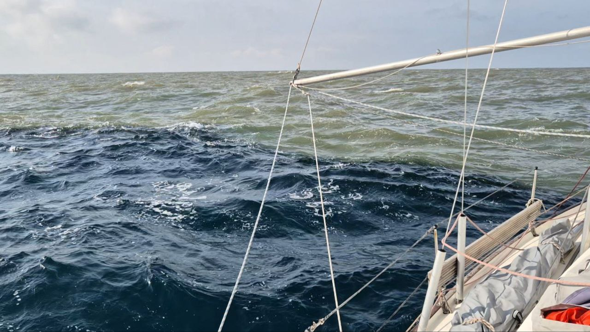
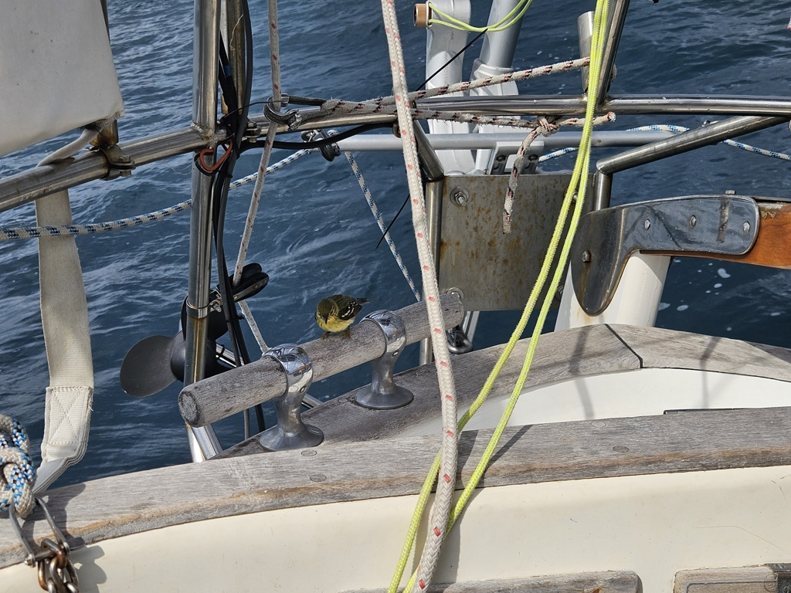

The brisk sailing winds of the day picked up to a full gale at night. We dropped the main completely and kept sailing downwind at 6-7 knots pulled just by the staysail. Big seas, but self-steering was able to keep things under control.

 

Passing the Magdalena river, our blue Caribbean waters turned into a grey muck. We kept sailing on, keeping a watchful eye for the occasional floating debris. Our timing had worked out getting here at daytime.

Winds here in Colombia seem to be a feast and a famine. The 40 knot winds of the night ended like a wall in the morning, and since then, we've been alternatively motoring or sailing slowly towards southwest. We have to bide our time in order to have a daytime arrival.

 

* Distance today: 113NM
* Lunch: pyttipannu 
* Engine hours: 3.2
