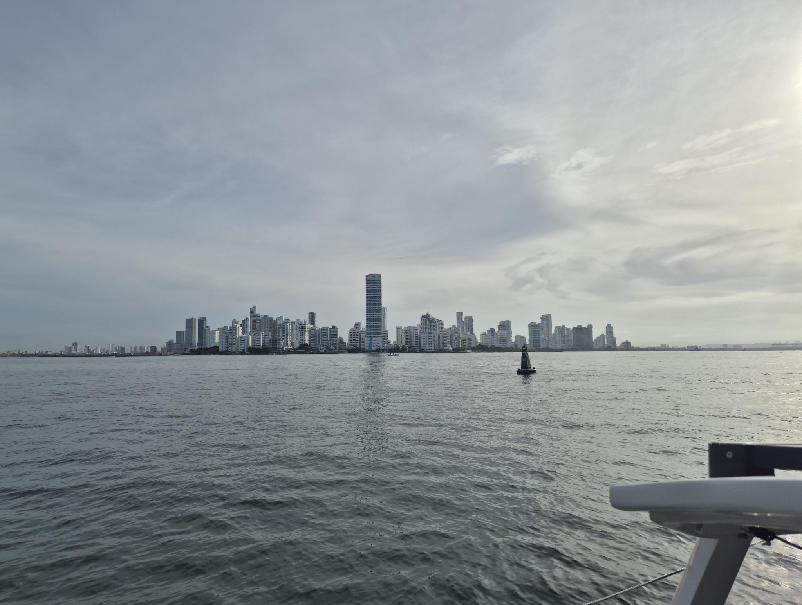
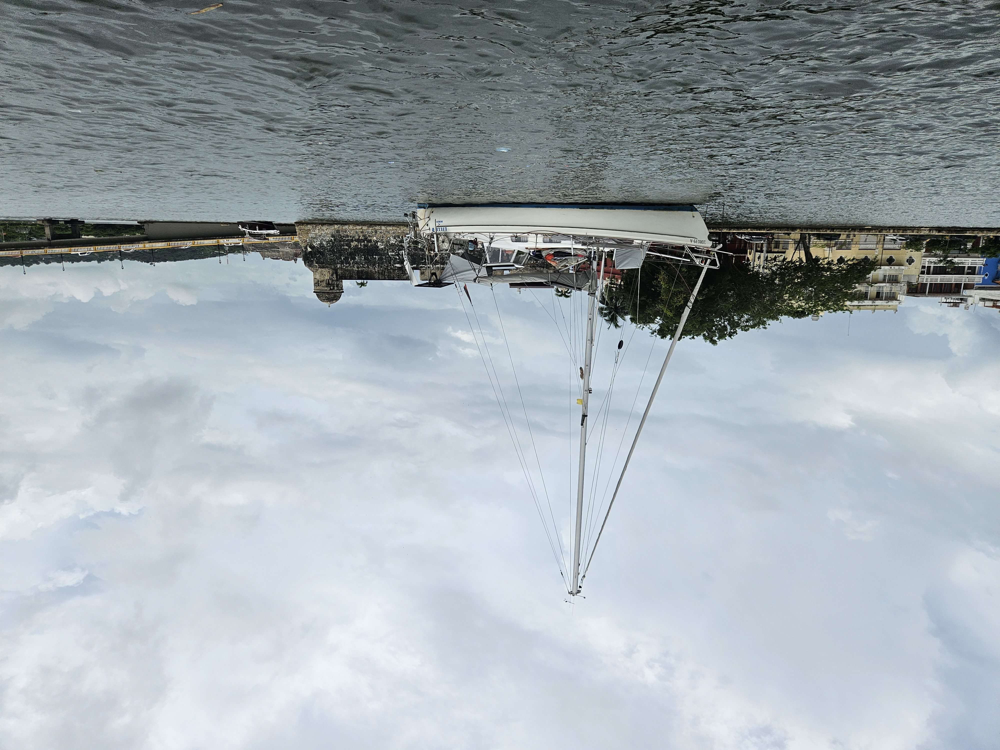

In the night we got to enjoy yet another free shower. In the darkness we could see a shape of a rain cloud, so genoa went in and mainsail down just as the downpour began. This time luckily without significant wind. The rain kept pouring for good couple of hours until it subsided to a mere drizzle. The current against made our progress slow, but finally at 7:30 we passed the Boca Grande sea wall! I'm thankful for whoever decided to open a small vessel entrance to it by blowing up a hole to it, as it made our arrival faster.

 

At 8:00 we were passing the naval base of Cartagena de Indies and were greeted by a whistle and the national anthem as the navy had a flag hoisting ceremony just as we passed. What a way to come in!

Soon after we found our corner of the anchorage, close to the old city wall. This anchorage is still on a no wake zone, and it was recommended to us by the lovely crew of _Breezen_. It is always best, when you have the lay of the land before arriving. 

 

Now we are in the middle of entry formalities and have a bit of time to get the boat sorted back to life at anchor. There is still time to kill before continuing our way westward.

* Distance today: 53NM
* Engine hours: 10.4
