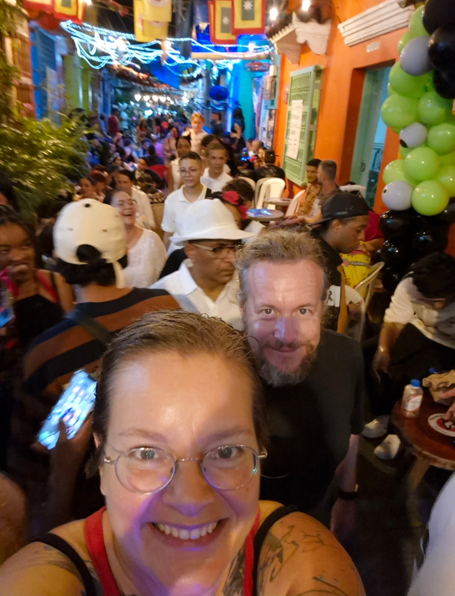
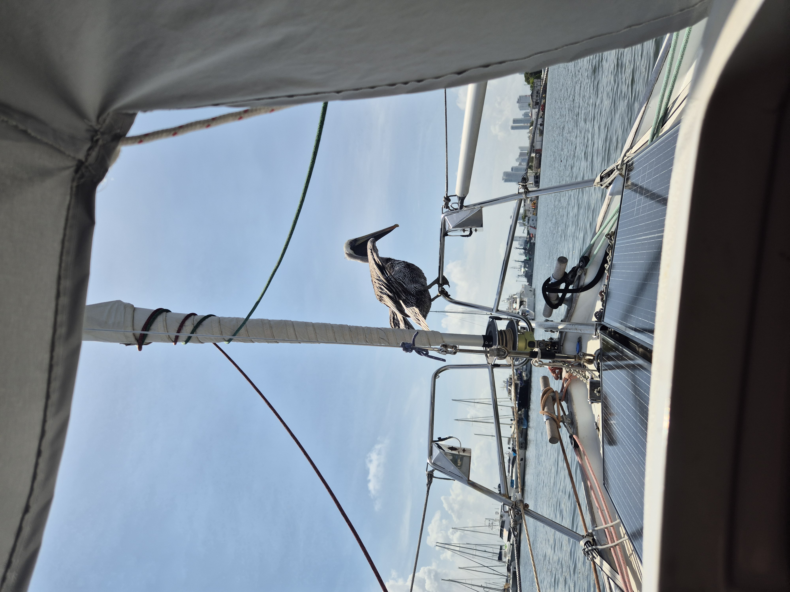

The first two weeks in Cartagena de Indias have gone quickly. Of course some boat projects, but mainly enjoying the sights and the offerings of a proper big city. Especially the Halloween out in Getsemani was quite memorable!

 

Next week is the celebration of the city's independence, and because of this, our anchorage will be closed. So today we hoisted anchor, visited the quite attractively priced fuel dock, and picked a mooring close to the Club Nautico.

The mooring field is less protected from the wake of the tour boats, and so early morning and around sunset is quite the washing machine. The no-wake zone of anchorage Foxtrot was nicer for that.

* Distance today: 0.5NM
* Engine hours: 0.4
