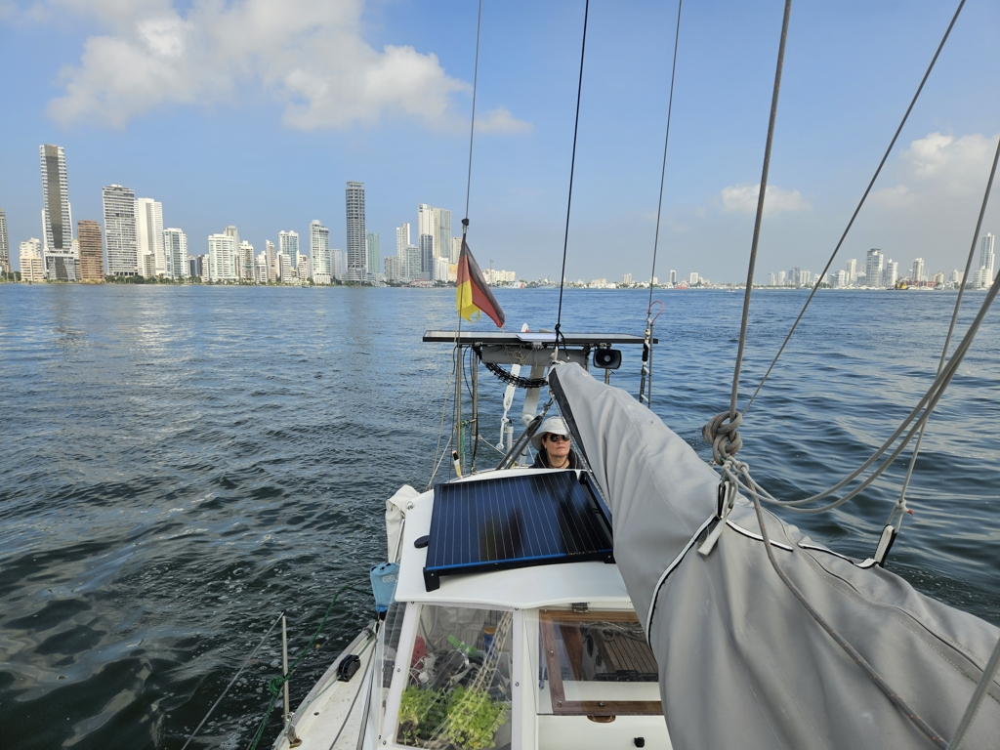

Our time in Cartagena de Indias was amazing. Last night we had an excellent fairwell dinner at Club Pesca with Graham and Mandy from _Mir_.

 

In the morning we cleared the boat into sea condition and dropped the mooring ball and headed out, this time through the Boca Chica. There you need to get your timing right with the traffic, as the channel is narrow and the other boats big. After getting through, we hoisted the main and genoa and are now slowly tacking towards southwest wind on the nose.

 

* Distance today: 23.2NM
* Lunch: salad
* Engine hours: 2.2
