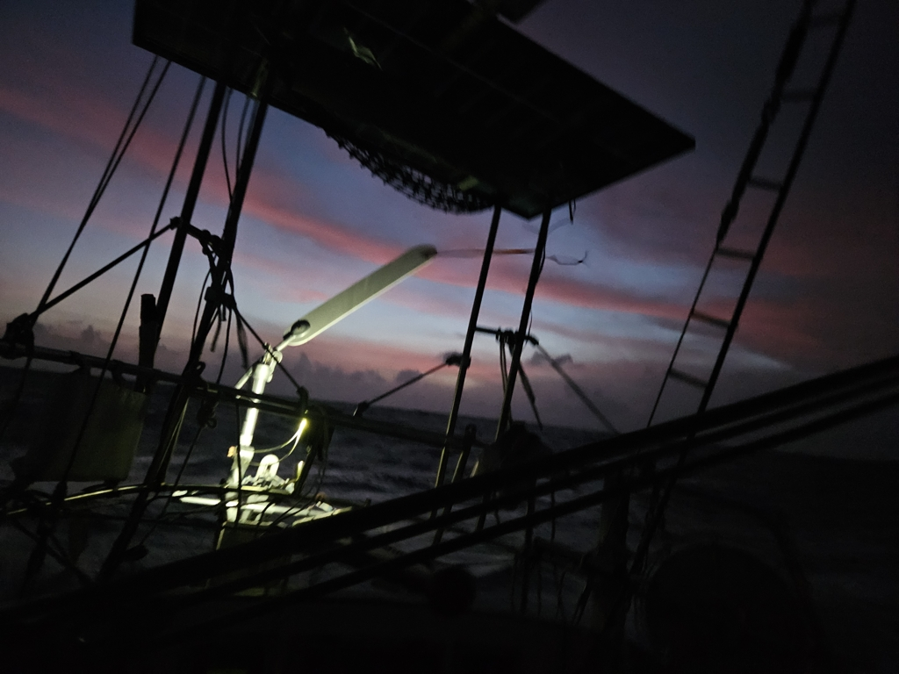

During the evening and night the wind both picked up and veered, so we could sail first on a beam reach, and later on a broad reach. Seas were quite lumpy, but the windvane kept us nicely on the course.
There's some shipping around, mostly from the Panama Canal to Cartagena, but radio traffic was at minimal.

 

In the morning the wind slowly reduced, until we had to start the engine just before noon. Panama is known for its light winds, and being able to sail even 2/3s of this passage meant this was a good weather window. Let's see if there's another patch of wind before we reach the coast.

A notable milestone for today is that we crossed 90°W on the Gothia Meridian (77°W on Greenwich).

* Distance today: 106NM
* Lunch: pea soup
* Engine hours: 4.5
