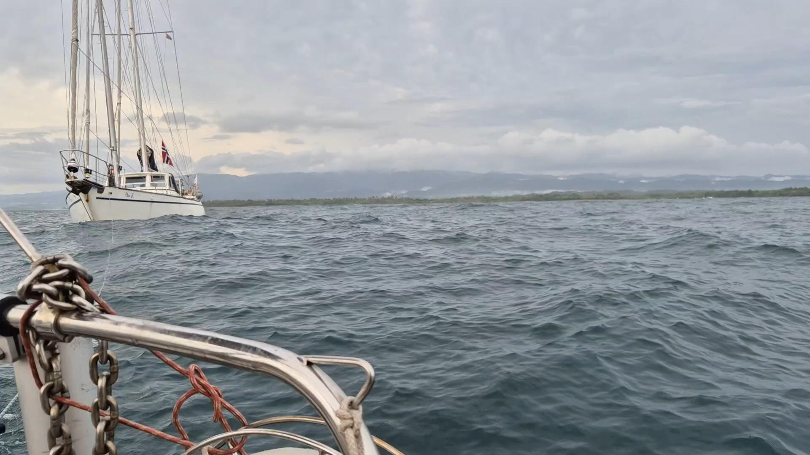
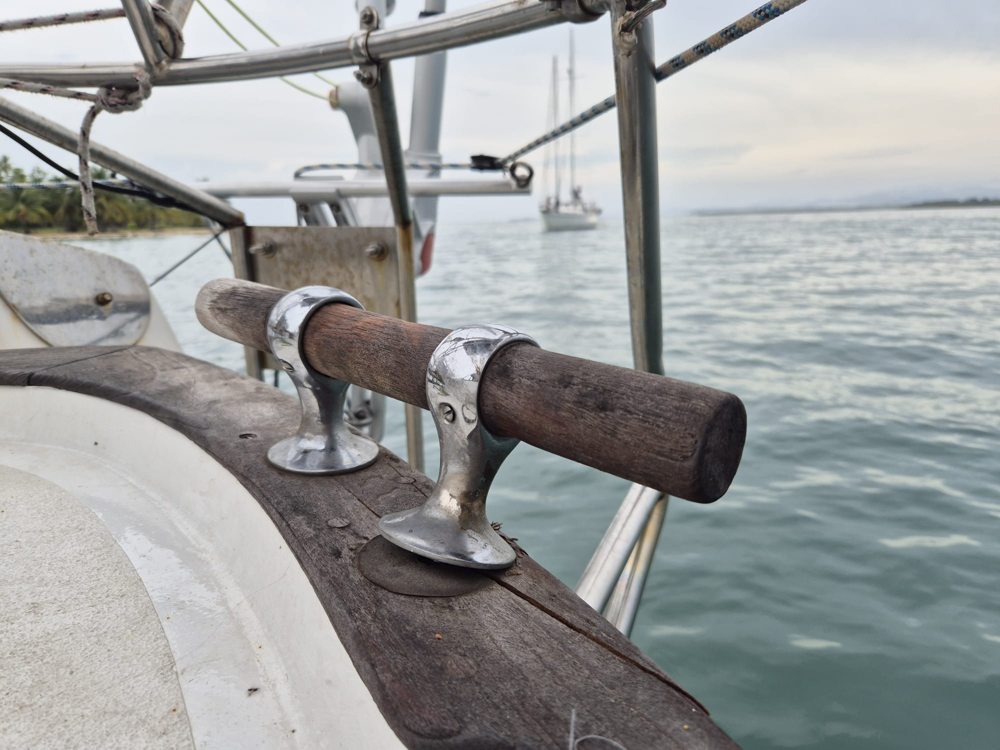

This was a lovely week in the beautiful Suledup anchorage. Time was spent dinghy sailing, swimming, and getting to know the nearby Guna village and their culture. 

But there are 364 other islands to explore in Guna Yala, and so we agreed to move on today. We waited for a rain front to pass, and then hoisted the anchor.

In the more diffuse light the reef pass out was easy to see, and soon we were under way. First hour passed easily motoring in windless millpond conditions. Then we got out of the barrier reef.

What waited was a 1.5m swell. With no sails and no wind to stabilise, the boat was getting tossed around quite badly. And then.

_"Lille Ø, Plan B, we lost our engine"_

Our buddy boat was in distress. No wind, no engine, and the swell relentlessly pushing them towards the reef.

With no time to waste we dug up the longest rope we could find and prepared for a tow. Now, their boat five times heavier than Lille Ø, meaning that this would be very very difficult. Starting with how to get the towing line to them.

 

Suski aced the throw, and the boats were connected on the first try. What followed was a slow, arduous, and tricky towing operation. Hardware was creaking, one of our stern cleats pulled halfway off the deck, and our pushpit slightly bent. But in an hour we were out of the waves and in a calm anchorage. All well.

Now we need to rest the adrenaline off, and then maybe tomorrow we can go and explore this island. The anchorage has reputedly already been used by the British privateer Francis Drake when plotting his next raids.

 

* Distance today: 9.3NM
* Dinner: shepherd's pie 
* Engine hours: 3
