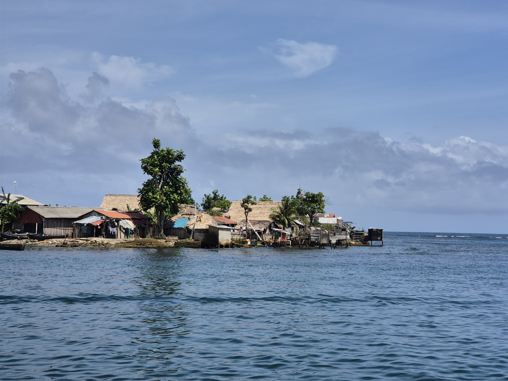

The sea state promised to be the calmest on this week, so we dared the next stretch of the open coast. This time we were not the only ones on the move, as we shared our way with 4 big catamarans and _Plan B_. The couple hour motoring was luckily uneventful and the motor of _Plan B_ was delivering propulsion reliably. 

 

The scenery is just amazing in here and now we are anchored off the town (5000 inhabitants) Ustupo. The rowdy seas should arrive tomorrow and last for a week, so well have plenty of time to explore the town and there is even a museum here!

 

Iddomalando (cheers in Guna language) Hannelore & Sunday club!

* Distance today: 14.4NM
* Engine hours: 4
