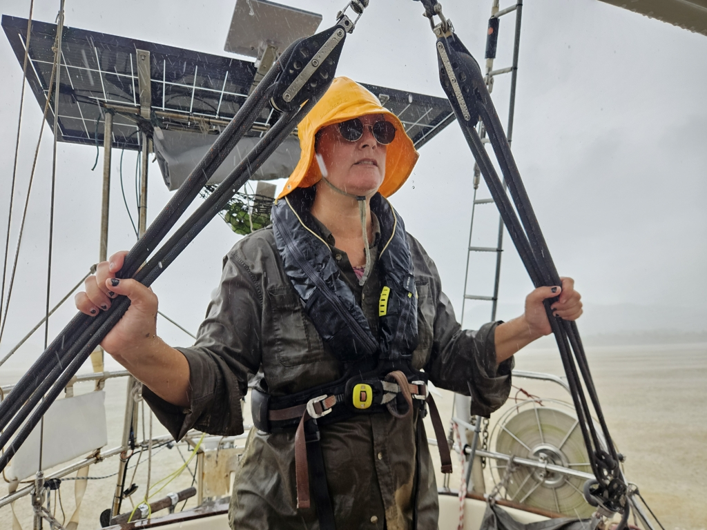
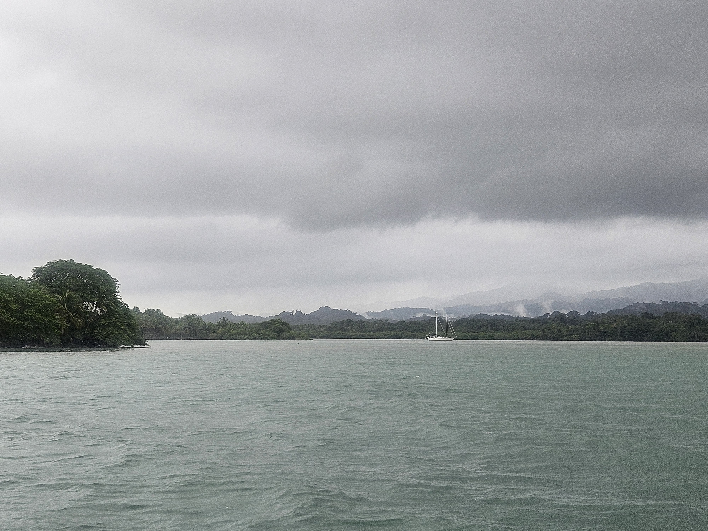

Today is the only one this week with seas less than 2m, and so we used the opportunity to motor ahead. Last days have been very dark and overcast, and so our State of Charge had fallen to 30%. Time to make some power!

It is no wonder the Scottish settlement attempt was in this area. We haven't seen so poor solar production since the Hebrides!

 

Today's route varied between protected parts inside the reefs, and quite rolly exposed spots. Using last night's rainwater, we utilised the rolling for agitating laundry, sailor-style.

Now we're anchored in the pretty and protected bay behind Mono Island. After spending a couple of days next to the biggest Guna village, pure nature again has appeal.

 

* Distance today: 18.6NM
* Dinner: pizza on the grill
* Engine hours: 5
