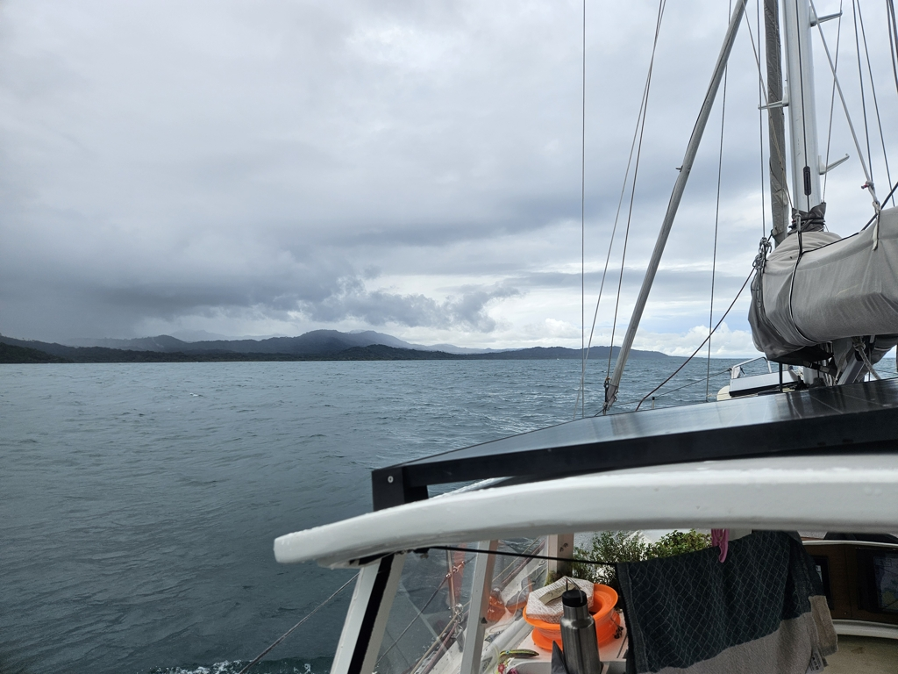

Almost a week passed in the pleasant anchorage, dinghy sailing and swapping sea stories. But finally today the sea state had settled a bit, and we could move on.

We hoisted anchors in a nice morning sunshine and motored into the flat calm sea. Easy conditions prevailed through the maze of reefs past Ukupseni.

Then suddenly every surface of the boat was covered in bees. And a tropical downpour that they were sheltering from.

 

We motored on in somewhat splashy seas, with both current and wind right on the nose. Eventually conditions moderated and the bees moved on.

Past Diablo Islands we turned in and arrived in the sheltered narrow lagoon of the Tiger Island (Digir Dubbu in Guna). We anchored, had an unsuccessful attempt at a radio conversation with _Sya_ en route to Jamaica, and then went to visit the village.

 

The difference between the Guna villages is quite apparent. Technology level, architecture, and the local rules vary a lot based on what the sahila degrees. This one is very organised, with ruler straight streets and tidy solar powered street lights. We got a brief tour, but then returned to our boats as the village is entering a ten day period of ritual cleansing.

 

* Distance today: 27.2NM
* Lunch: chanterelle rolls
* Engine hours: 7
