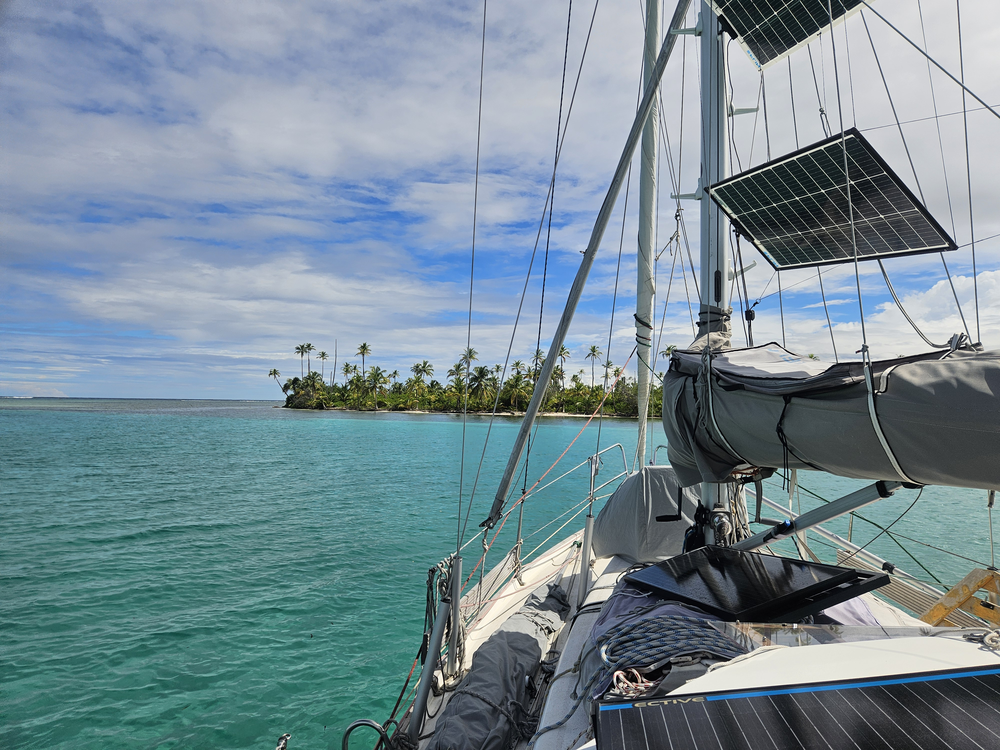
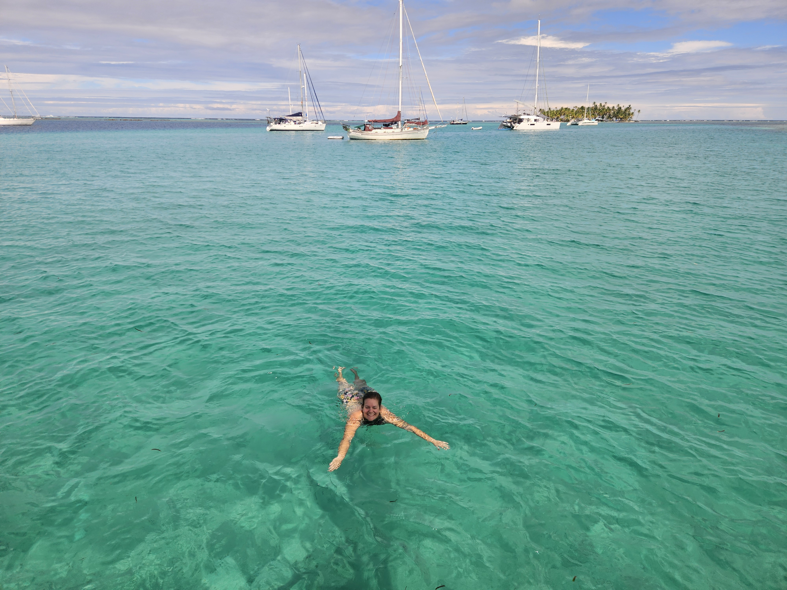

Hoisting the anchor was not the easiest as the anchor was 11 meters deep. After Bergie had caught his breath again, we carefully manouvered through the west entrance and headed towards Banedup under engine. The  archipelago in here is wider and there is more reefs protecting us from the swell, so we made decent progress.

Now we have clearly reached the more beaten path. After weeks in the relative wilderness, suddenly there were sailboats anchored all around us next to various palm islands, and actual traffic to consider.

 

3 miles to destination, we felt the wind pick up. Quick! Hoist the sails! We can actually SAIL our sailboat!  It became a marvelous bit of beam reach in 10kn of wind and 40 meters of water.

 

We dropped sails outside of the reefs and motored in. We dropped our anchor in 3 meters of crystal clear water, there is a reason why cruisers call this anchorage the Swimming Pool. This stop might take a while as I feel  the need to turn into a sea otter once again.

 

* Distance today: 14.5NM
* Dinner: pizza
* Engine hours: 3.2
