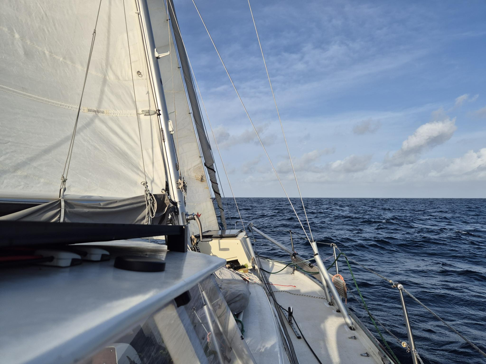
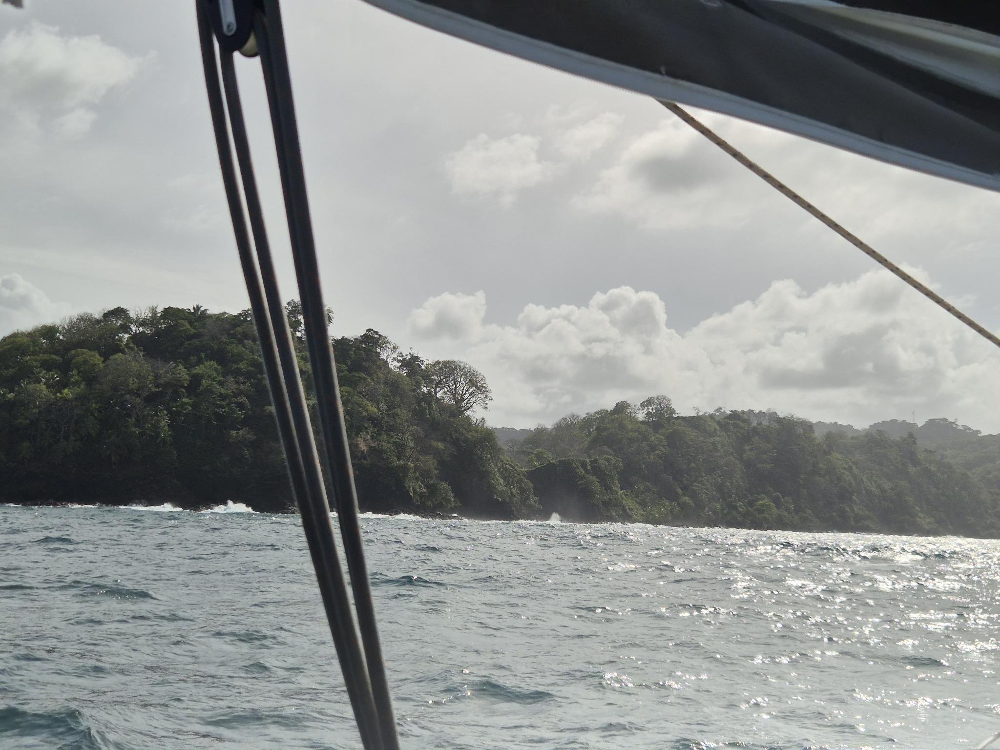

At dawn it was time to hoist the anchor from 11 meters deep. It is quite the workout. We carefully manouvered past the reefs  in first light.

 

Main in 1st reef and staysail went up. With the sunshine came also the 20kn winds that we had been expecting. Finally, fast sailing with the wind and current behind us! The 40nm went quickly and we both were enjoying the sailing. Abeam Nombre de Dios the wind calmed to around 10kn which with the 2 meter swell made an uncomfortable approach to the narrow pass to Linton Bay.

 

As we were approaching Robin commented in the chat _"From AIS it looks like a German invasion"_

We and apparently all other German boats had decided that today is a good day to sail to Linton Bay. After a bit, the waves calmed down and we ghosted along with 5kn of wind untill we reached the anchorage.  We dropped anchor at 12 meters and are now well staged for our haul out next week. Time for some new bottom paint!

* Distance today: 44NM
* Lunch: pea soup
* Engine hours: 1.4
