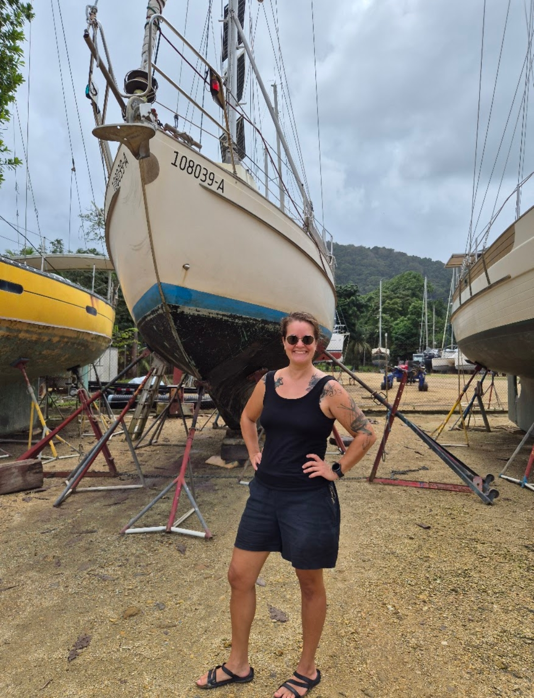

There was a slight intermission as we helped _Plan B_ through the Panama Canal and I passed my Full amateur radio exam. When I got back to Linton Bay, there was the awaited WhatsApp message: _"we can haul out your sailboat tomorrow morning"_.

And so after morning coffee it was anchor up and motoring around the reefs to the next protected bay.

At Panamarina we waited for a couple of hours on one of their mooring balls while they attempted to hoist a catamaran. Then came our turn. The process of arriving to the slip wagon was easy, aided by a dinghy operating as a harbour tug.

 

Everything went smoothly, from lifting the boat to pressure wash, and parking the boat on the work yard. This is the first time we're not doing the haulout by ourselves, and it was weird to just stand idly and watch others work.

 

The yard inside the mangroves seems nice and DIY spirited. There's a French restaurant and a small chandlery. And it is a short dinghy ride to the bigger chandlery in Linton Bay. Now we can work on antifouling and close some seacocks.

* Distance today: 2.5NM
* Lunch: lasagne
* Engine hours: 1
