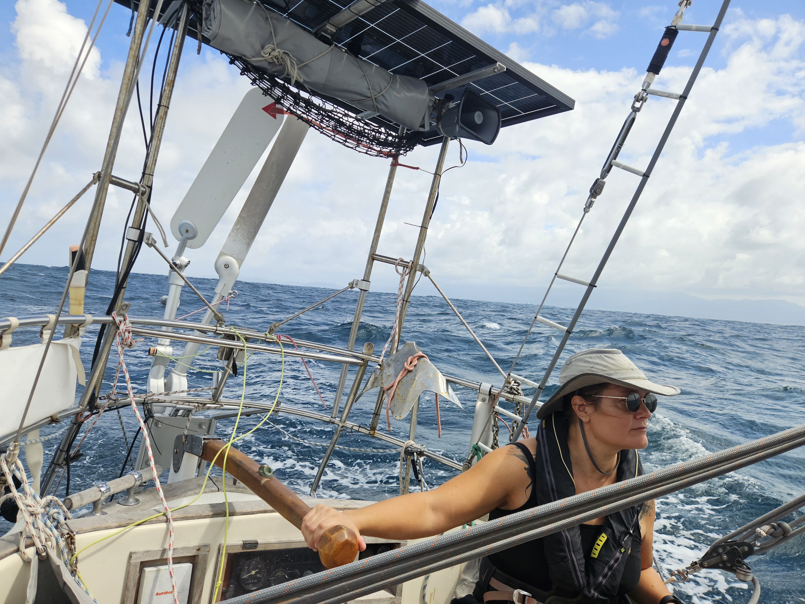

Finally the rain stopped in the early hours. We woke up with the sun, prepared the boat for a proper shakedown after the yard time as the waves were crashing to the reef outside hard. So, motor on, and away! After the reef pass, we were fully in the Atlantic swell again. We slowly pushed through untill we had enough room to start sailing. We hoisted the main in 1st reef and rolled out a sliver of genoa and turned to our rolly downwind sail towards Shelter Bay.

The seas were big and lumpy. The occasional breaker would push us to a nice speed or try to veer us off course. 

 

At 8 miles to Shelter Bay breakwater we contacted the Cristóbal Signal Station for the first time. We were given a secondary checkpoint at 2NM to breakwater. There we were given permission to enter behind _As Felicia_. The last moments were very rolly but we made it through and could enjoy a mile of smooth sailing before it was time to pump the fenders and prepare the lines for the Shelter Bay Marina. Now we are tucked in still water and can start the final push to get the boat to be ready to go for the Panama Canal. So: farewell Atlantic, you were good to us!

 

Kippis Bernhard!

* Distance today: 27.4NM
* Lunch: potato salad
* Engine hours: 1.2
