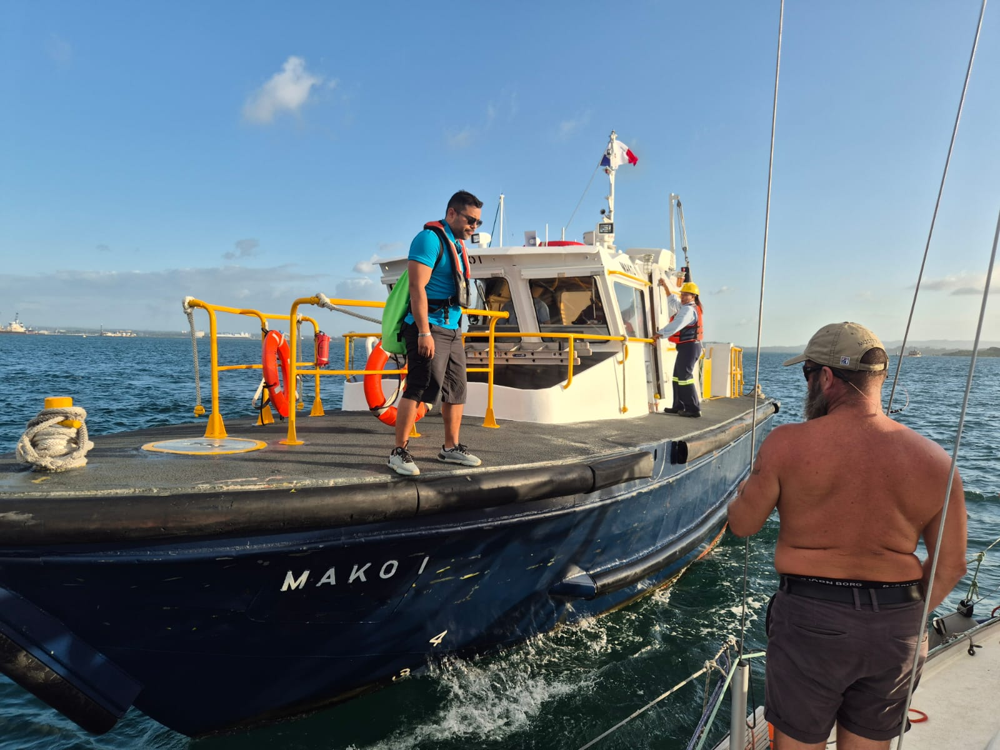

The few days of preparation at the marina went by quickly. Then came the awaited message: _"Hello transit day January 8"_.

And so we did another round of grocery shopping, got our linehandlers (crews of _Plan B_ and _Katydid_) on board. With the expert assistance from the Shelter Bay dockmaster, leaving the tight spot was easy. Lille Ø is so small that we shared a box with a katamaran!

 

We anchored in The Flats for a couple of hours and then got our Canal Advisor on board. We would be doing the transit rafted up with a 42ft catamaran and a 45ft monohull.

The three lock chambers went without any major hassles. There was some light rain exactly when we were having dinner, but that was the biggest glitch.

 

Now we're side-tied to one of the canal overnight buoys on the Lake Gatun. For the short moment again, Lille Ø is a freshwater boat!

* Distance today: 10NM
* Dinner: spaghetti bolognese
* Engine hours: 4.7
