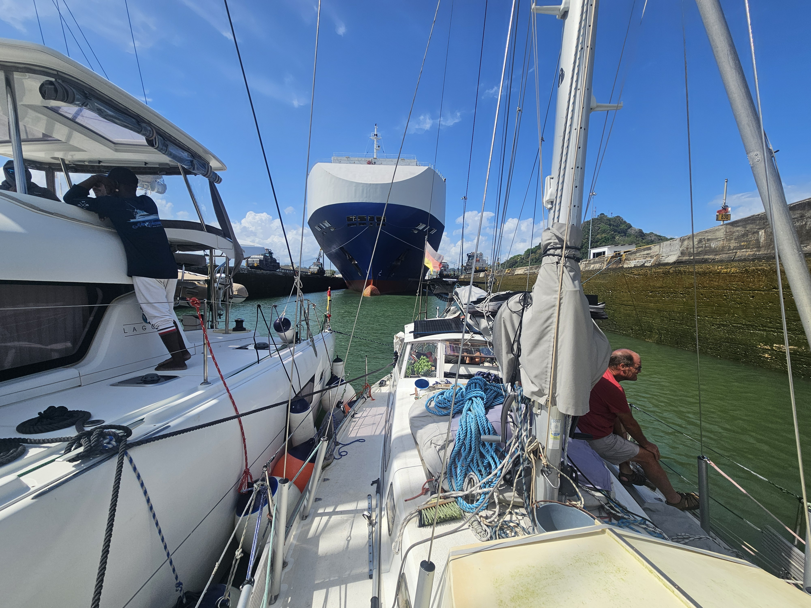
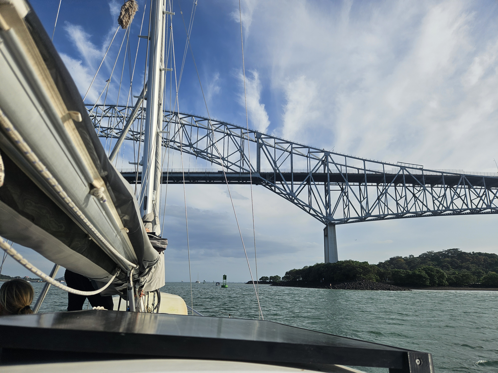

The alarm rang at 6am. Expected time for advisor 07:15. So coffee and hearty breakfast were consumed and to everyones slight suprice the advisor came on board exactly when promised.

 

He didn't want more breakfast, only coffee. At 7:30 we were already on the way. The drive through Gatun Lake was hot and long. Along the way we only once needed to lower our speed to avoid a narrow spot with a New Panamax class vessel. After that, it was back to 2300 rpm and 5.5 knots of  speed. At 12 we arrived to the first locks. Before entering we rafted with _Aero_ and _Pango_ proceeded to drive us all in in the quattromaran formation. Then down the first locks, a small drive to the next set. 20 meters down and then. Pacific Ocean!

 

Kippis Henrik!

* Distance today: 37.4NM
* Lunch: spinach quiche
* Engine hours: 9.9
